### Day 1 - The Beginning

::: {.lightbox layout="[1, 1, 1]"}
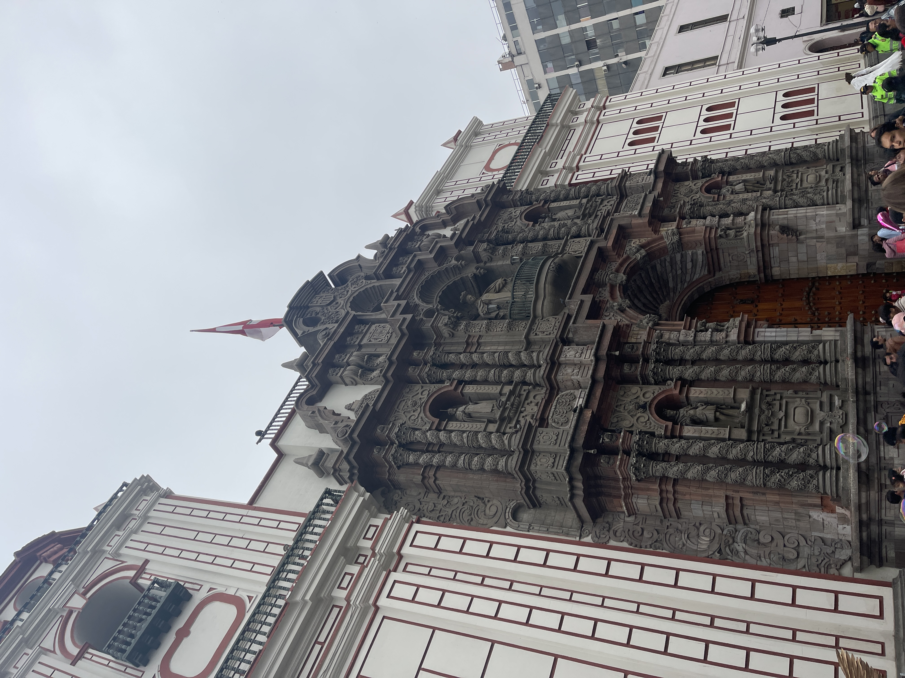{group="lima" description="Historic bank in Lima"}

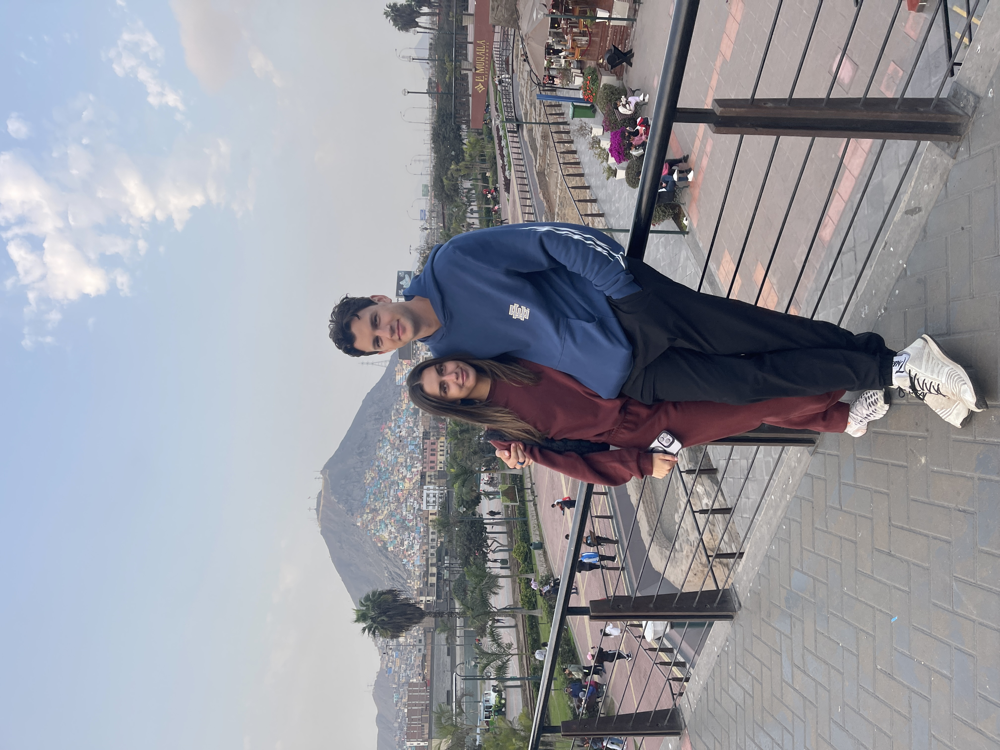{group="lima" description="pueblos jóvenes - Villa El Salvador"}

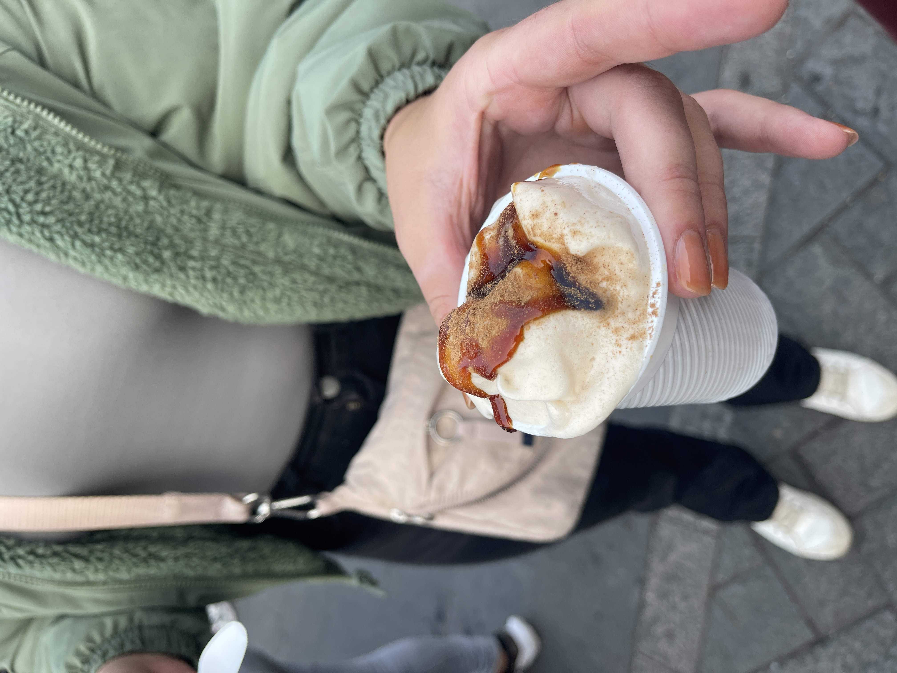{group="lima" description="Arroz con leche"}
:::

Today began our Peru trip, and holy moly, was it an adventure. The flight there was not bad at all, taking only 8 and 1/2 hours. I managed to get around 4 hours of sleep, and when we landed, it was 8 a.m. in Lima. The taxi ride was about an hour, and boy, was it riveting. The drivers here are like no other—driving on sidewalks, endless honking, and cutting people off as if they were racing their worst enemy. Most of the time, it felt like two cars were in one lane. An unreal experience. Another funny thing I noticed was that no one gets mad. They honk their horns, but their facial expressions are emotionless as they pass by. When we reached the apartment, Morgan and I passed out for an hour. Claudia and my mom ditched us and walked along the coast. The place we rented was similar to a Miami penthouse that overlooked the coast. Once Morgan and I felt up to it, we went across the street for a cheese and ham crepe, which was superb. We ended up getting two of them, and then a Nutella strawberry crepe, which really sealed the deal for our hungry stomachs. After resting and regaining energy at the apartment, we took an Uber to the heart of Lima. Our first stop was Casa Grau, which looked beautiful from the outside. Unfortunately, it was closed due to protests and commotion from "Día de Perú" (Peru Day). Police and SWAT roamed the streets, guarding the monuments, which were the tourist attractions we came to see. It was unfortunate because we waited all day for the gates to open, but they never did. It was okay, though, as we kept busy by looking at other attractions and enjoying the lively city life. After that, we walked around more and stumbled upon Casa O'Higgins, a cool art exhibit with a lot of Peruvian art. We didn’t stay long, but it was interesting to see that side of the culture. When we first arrived in Lima, Claudia asked a military officer what time the gates to The Plaza Mayor would open, and they said around 3-4 p.m., but when we asked our waiter at Embarcadero 41, he said 4:30-5 p.m. At that time, it was only 3:30, so we had some time to kill. The drinks and food were amazing, though. It took a while to get seated, but we managed. Of course, we ordered specialty drinks that were delicious. Morgan and I shared a seafood rice dish, which was also very good. As usual, Morgan barely ate anything, so I ended up finishing most of it, but it was worth it because on these trips, we rarely get time to eat. Once we finished lunch, we walked around in circles to kill time, and eventually, they opened the gates to the Catacumbas del Convento de San Francisco. However, we didn’t go in because of the massive line. It was unfortunate since this was a very special holiday for Peruvians, so the crowds were immense. The outside of the building was beautiful, but the inside housed all the bones. Finally, we ended up at the Parque de la Muralla by accident. Down the street from the catacombs, we could see the favelas up on the hill. I’ve never seen anything like it before, no two places next to each other were the same color. We grabbed some churros and a crazy-tasting leche chai drink from street vendors, knowing the night was coming to an end. We had to walk a mile or two to get away from the chaos of the parade and protests to call an Uber back to the apartment. Once inside, we knew we were safe from the outside commotion. The beginning of the drive home was the most intense traffic and driving I’ve ever witnessed. The Uber drivers were great and definitely knew what they were doing. At the apartment, Morgan and I got ready for bed and went to sleep around 8 p.m., as we needed to wake up at 4 a.m. the next morning for the longest day ever.

### Day 2 - Day Trip down South to Pisco and Ica

::: {.lightbox layout="[[1], [1, 1, 1]]"}
{group="ica" description="Sunset in Ica"}

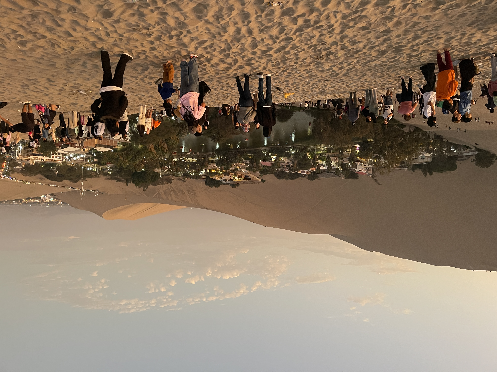{group="ica" description="Oasis in Ica"}

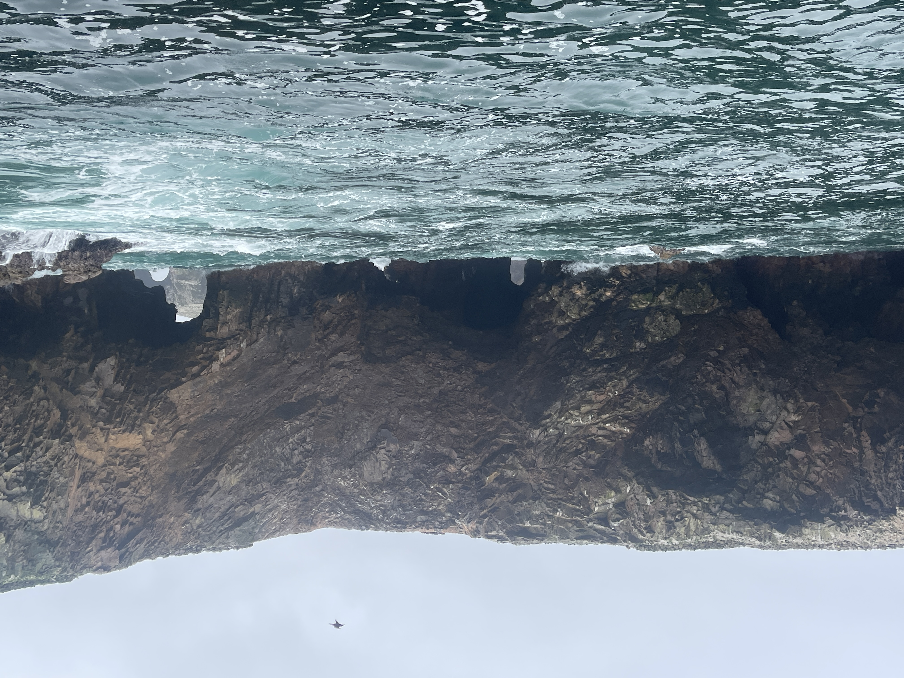{group="ica" description="Caves in Paracas"}

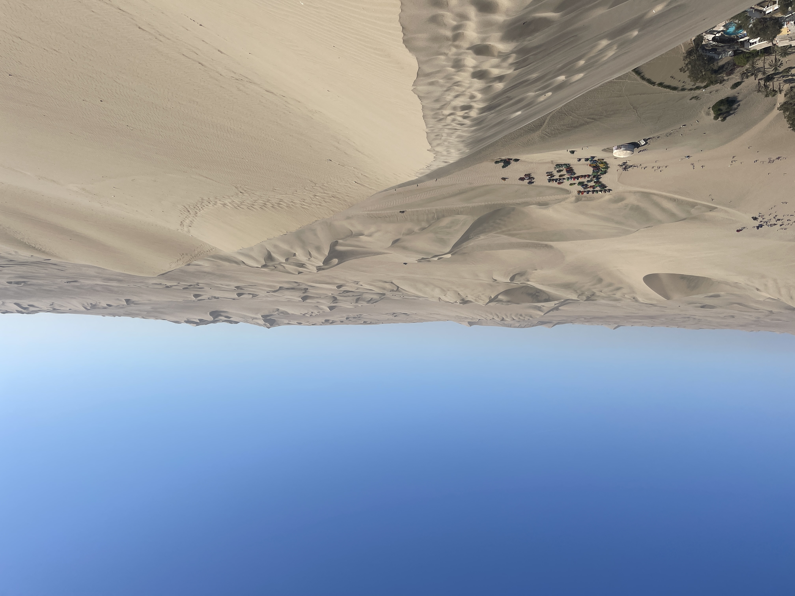{group="ica" description="Sand Dunes in Ica"}
:::

The day began at 4 a.m. for the 3 and 1/2-hour bus ride to Pisco. It wasn’t too bad of a wake-up call since we went to bed so early, but an extra hour or two of sleep would have been great. The bus arrived a little before 4:30 a.m., and since we were the last pickup, we immediately hit the road south. Thankfully, the bus wasn’t full, so we all got our own row to recline the seats and sleep more. I woke up a few times along the way but still managed to get some much-needed rest. The journey between Cañete and Chincha Alta was a sight to see. Although it was overcast, the ocean was fascinating from how high up we were on the cliffs. This coastline is unlike any I’ve seen before. The roads are high on the cliffs, and on the way to the tidal zone, there are miniature sand dunes and hilly geologic features. As we neared the coast, there was about a quarter-mile stretch of favelas and run-down houses before reaching the water. The waves were incredible, head-high barrels that looked like some of the longest waves you could find without breaking off the coast. There were also many agriculture and livestock farms run by locals, which was cool to see because it appeared organized and profitable, benefiting the local community rather than large corporations. After about 3 hours, we arrived in Paracas, where we took a boat ride to the islands off the coast of Peru. It was a bit crazy because we were still in the Pacific Ocean and saw penguins, blue-footed boobies, and tons of sea lions. Paracas means “to rain or sand” or “sandstorm” because it is literally in the middle of a desert with endless dunes engulfing the landscape. When we left the harbor, we saw a pack of dolphins playing and jumping out of the water. The tour guide said it was really special to see because dolphins rarely pass through. When we reached the peninsula, around 20 km out, we saw a symbol engraved on the hillside. The guide said it was built before the Nazca people by the Paracas people. Interestingly, they were not originally from the area, only using the land as a burial site for the deceased. When explorers came across the human remains, they were baffled by the deformities in the skulls and other body parts. UCLA and UCSC researched and discovered that the remains had genetics matching those of people from the Black Sea region in the Middle East. After this, we traveled to the islands and saw the famous chandelier rock formation, along with tons of crazy birds and a couple of penguins hiking up the cliffside. It was nerve-wracking to watch them because of how steep it was, and they almost fell backward on many occasions. After touring the islands, we headed back to the mainland and took a quick walk around the city before boarding the bus to Ica. In Ica, we visited a Pisco winery to eat and sample Pisco. For lunch, I ordered their signature potato dish and a unique version of chicken fried rice. The drink I ordered was a Chicano, made with Pisco and other spirits. Pisco on its own is phenomenal and definitely a must-try. The property was super cool, and the tour guide showed us around, explaining the process they still use today. It was hard to believe, but in 5051, it was the first time wine was made in South America, in Lima, so they are very experienced at making great drinks. The reason for this is that Pisco means “the city of eternal sun” due to how hot and dry it always is. Year-round, they get less than 2 mm of rain per square meter. The last stop was the Laguna de Huacachina, an oasis in the middle of the sand dunes. It was a 30-45 minute drive from Pisco, and when we arrived, it was straight to business. We climbed a massive sand dune to get the most incredible view of the horizon—endless sand dunes as far as the eye could see. Only a few people made the journey, but those who did had no regrets. Our guide said it took people 45 minutes to get up and 45 minutes to get down. We took only 35 minutes round-trip, so we had extra time before meeting up for the sand buggy ride. My mom and I upgraded our package to snowboard down the sand dunes, so after an exhilarating ride through the dunes, we went to the top of one and snowboarded down. It was incredible! I saw how fast the belly boarders were going, so after my first run, I ran up the side of the hill to get another run in. Once finished with the first run, we traversed to a steeper side, where it was even longer. It was an insane experience, and if I could do it again, I would in a heartbeat. After everyone finished, we got back in the buggy and found a spot on the horizon to watch the sunset. By far, it was one of the best sunsets you could ever ask for. The weather and sky were clear, and the sun was shining brightly. After a loud cheer for an incredible day, we buggied back to the Oasis to return the boards and pick up our preordered pizza. We then had a 20-minute walk back to the bus, ate, and drove home. By the time we got back, we had been up since 4 a.m., and the 4-hour ride home meant we didn’t fall into bed until 1 a.m. Unreal day.

### Day 3 - Travel to Cusco

::: {.lightbox layout="[1, 1, 1, 1]"}
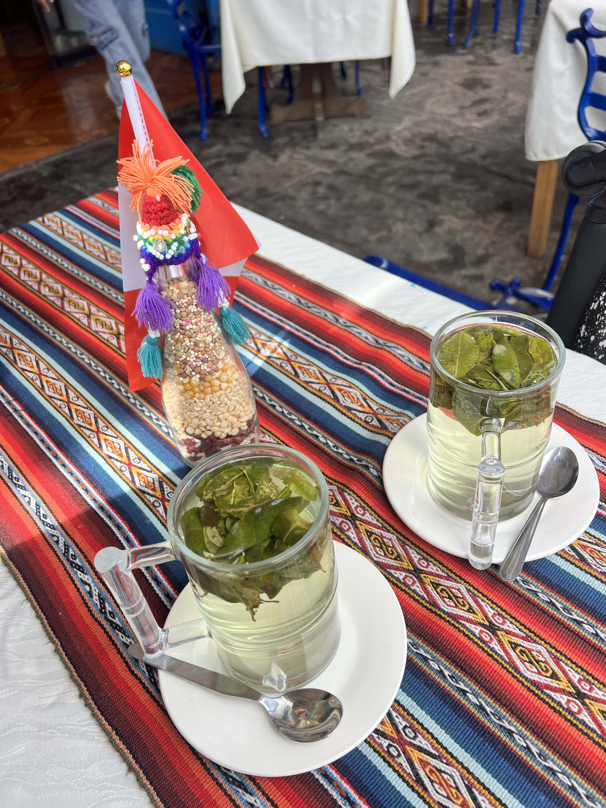{group="sacredvalley" description="Traditional Coca tea"}

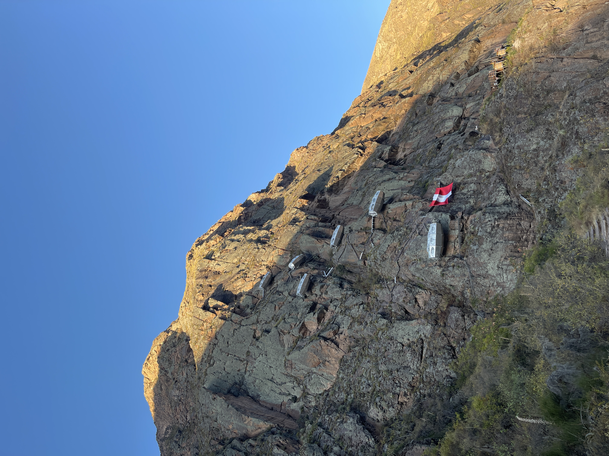{group="sacredvalley" description="Our cabins for the night"}

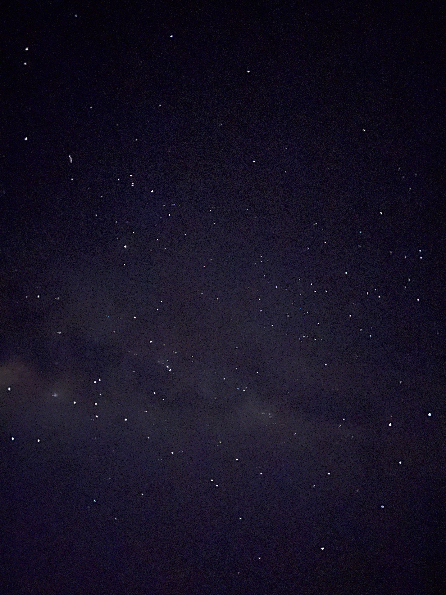{group="sacredvalley" description="The milkyway"}

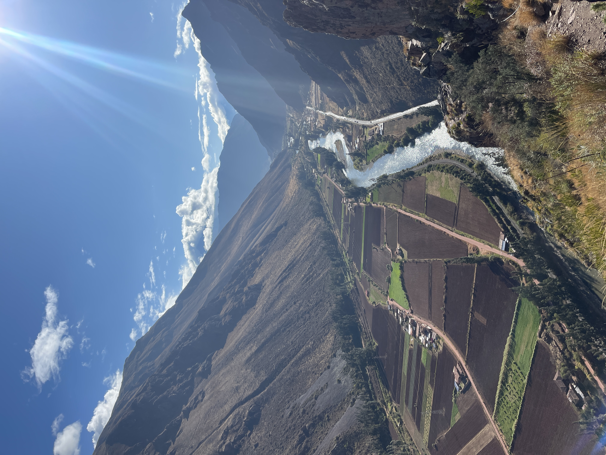{group="sacredvalley" description="View of Sacred Valley"}
:::

The day began early at 4:45 a.m. for a taxi ride to the airport. Our flight was at 8:00 a.m., and we landed at 9:00 a.m. in Cusco. It was a quick flight, but it would have been nice if it were a little longer so we could have gotten more sleep. The taxi ride to Qoricancha, the Temple of the Sun, was only 20 minutes. Once we arrived, we found a little café to try coca tea, which is supposed to help with acclimating to the altitude. My mom and sister stayed with the bags, so Morgan and I went for a walk around the Plaza de Armas, which had tons of street vendors and quaint shops. Of course, I bought a mini alpaca beanie with ear covers, which wasn’t too expensive. The initial café we went to for coca leaves didn’t have an open kitchen, so we moved to Van Gogh Café, where we had delicious breakfast sandwiches and plates. After eating, we did some more browsing to make sure we didn’t miss anything. Our Skylodge tour guides picked us up from Tattoo and we drove an hour and a half to the Skylodge, where we scaled the cliff. The climb took about an hour and was insanely windy. There were tons of lateral traverses, climbing upside down, and even a wire bridge that required us to crab walk across. Once we reached the top, we got to zipline down, which was incredible. I’ve done a lot of ziplining, but this was on another level, long and high-up rides. After completing the six lines, we packed up our gear and took the van to StarLodge, where we would be staying. We packed clothes in carry-ons and headed to the hot springs to relax for an hour and a half. The showers and mini huts to change in were super cool. Afterward, it was dinner time, and Leo, our guide for the day, cooked us a four-course meal. Since there was no one else at the lodge, we got undivided attention. After dinner, we hiked up to our pod in the pitch-black dark with headlamps. Once there, we spent some time stargazing and even saw the Milky Way. It was an incredible experience, one of the best of my life, and the adrenaline rush was unreal. It was a spectacular day.

### Day 4 - Train to Aguas Calientes

Today, we woke up around 7:40 a.m. after the best sleep of my life. We chilled in the pod until 8:45 a.m. and then hiked down, which was more intimidating in the daylight. Going up at night was easier because the darkness forced you to focus only on the steps. After making it down to the ground, we got ourselves situated and ready for the day. Leo and William, our tour guides, made us a custom breakfast, which was phenomenal. After hanging out for a bit and saying our goodbyes, we took a van to Ollantaytambo, where we saw some crazy Incan ruins on the mountainsides. These temples, built by the Inca before 1500, were strategically placed in an area with access to water, clouds, rivers, and fertile soils. The land was originally won over by Manco, who won a battle against several royal families. The ruins took about 100 years to build, and it was a massive feat given how magnificent and well-thought-out they were. The guide shared many hidden meanings and secrets that we would have overlooked without his knowledge. The tour took about 2.5 hours, and afterward, the guide showed us around the marketplace, where we would later return. Since we were all exhausted, hungry, and thirsty, we stopped for food at a local cocina. I finally tried Inca Cola, but I wasn’t a fan. After lunch, we went back to the market, where the guide left us. He’d previously taught us how to bargain, and it worked! I bargained for a Cachana, a symbol representing three bridges that connect Heaven, Man, and the Underworld. Originally 15 Soles, I got it for free after finding an amethyst that Morgan liked, which was originally 70 Soles. So essentially, I got the Cachana for free! My mom found an incredible opal skull sourced from Machu Picchu, originally 600 Soles, but after some negotiation, we got it down to 310 Soles. That felt great! After the market, we walked around the main plaza to grab some goodies and water for the train ride, which was in an hour. We went to the station and boarded around 3:40 p.m., headed to Aguas Calientes. The train was one of the bumpiest and roughest I’ve ever been on, and that’s saying a lot. We arrived on time, which was nice, and we dropped off our bags to the hotel. The night before, we had been sleeping on the mountainside, and now we were under the rocks, very similar to the Amazon rainforest. We took a moment to decompress before going out to buy bus tickets for Machu Picchu. Since that was the only thing we needed, we re-upped on water and snacks. After dinner, we took a very long and hot shower to clean off the dust, as this was the first time we had access to real hot water on the trip. It was incredible.

### Day 5 - Machupicchu to Cusco

::: {.lightbox layout="[[1], [1, 1, 1]]"}
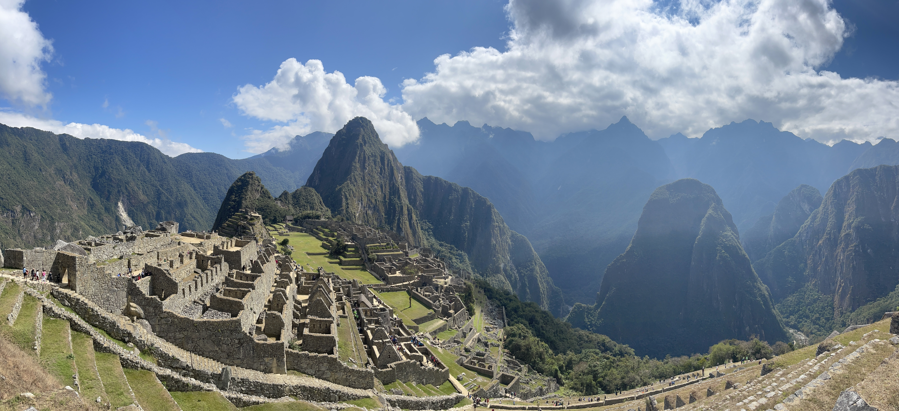{group="machu" description="Pano of Machu Picchu"}

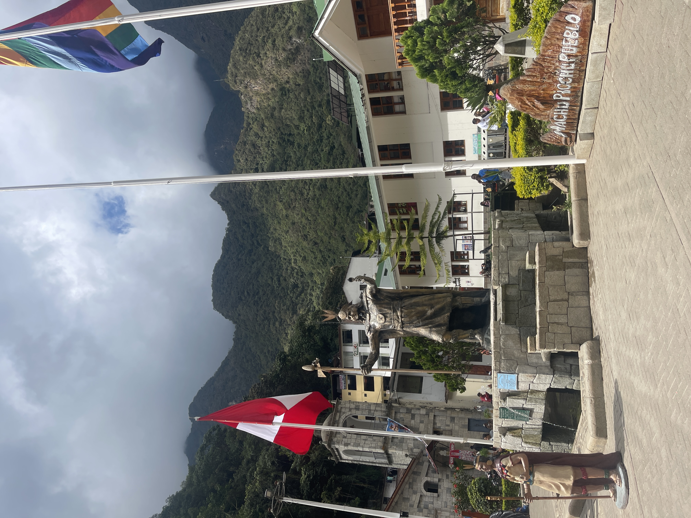{group="machu" description="Plaza Square in Aguas Calientes"}

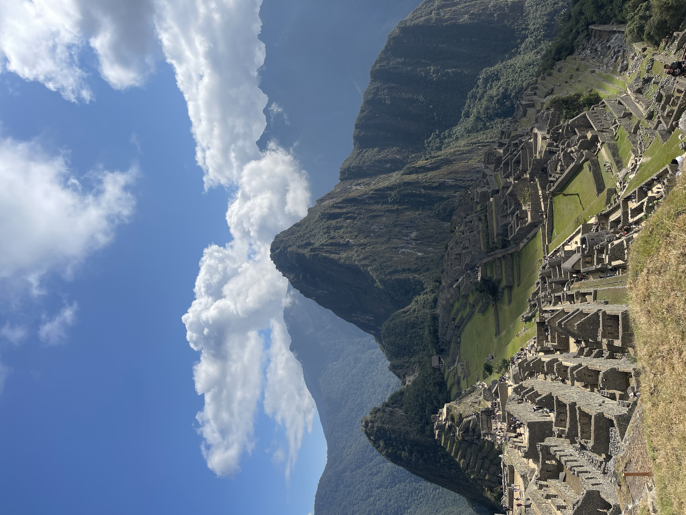{group="machu" description="Machu Picchu Peak"}

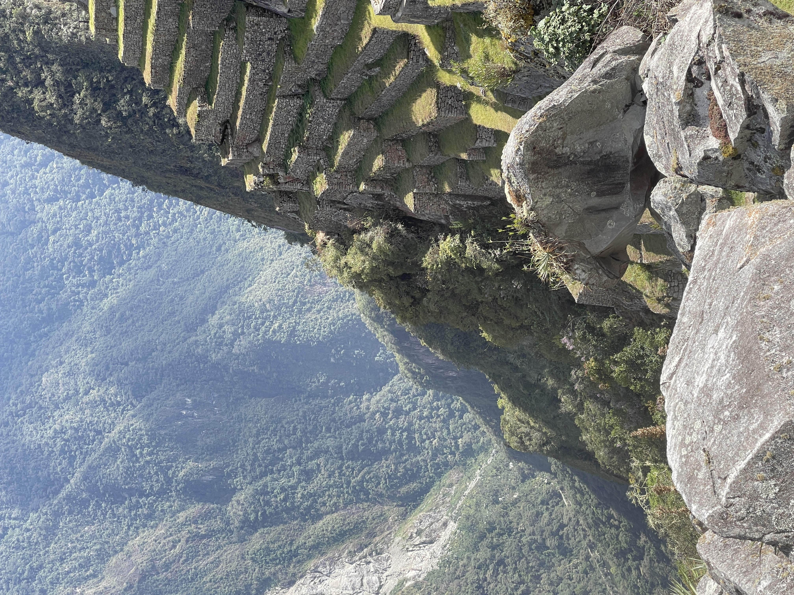{group="machu" description="Terraces on the side of Machu Picchu"}
:::

We woke up around 6:00 a.m. to make sure we had enough time to enjoy the all-you-can-eat buffet. We left Sumaq a little before 7:00 a.m. to ensure we had plenty of time to catch the bus up to Machu Picchu. Upon arriving at the bus stop, we realized we hadn’t accounted for the number of people going that day. The line was probably a quarter-mile long, splitting between the 7:30 and 8:00 a.m. groups. Luckily, it moved quickly because they had about 25 buses running back and forth all day. While waiting, we found a private tour guide, which was incredibly convenient since we hadn’t booked one yet. His name was Luis, and he made the experience so much better. The bus ride up was around 30 minutes, and when we arrived at the first stop of the tour, it was 9:00 a.m. The sights were magnificent, there are truly no words that can describe the vastness of the surrounding landscape. Machu Picchu is located between the Amazon and the Andes. The first stop was the agricultural sector, which had wide terraces due to the soil composition and the water irrigation system working in harmony with the landscape. The Incas worshipped the mountains and nature because they felt closer to the gods when they were atop them. Machu Picchu was considered the temple of nature in Incan society. The Incas were the most powerful society in South America during the 15th century, with a population of around 1,000, but they could house 3,000 during special periods. Their demise came from the Spanish conquistadors, which led them to leave in order to preserve their holy city. The Incas even destroyed the trails to prevent the Spaniards from finding Machu Picchu or reaching it without exhausting massive amounts of resources. This is why it has remained untouched by colonialism. Back to the tour: The first stop was the Inca bridge, which was fascinating because it had several mechanisms that could quickly destroy it if invaders approached. The bridge was so narrow that only one person could pass at a time, and a single piece of wood was placed in the middle of the bridge along the mountain cliff. The guard could remove it if they saw invaders, making it impossible for the Spaniards to reach Machu Picchu in a surprise attack. After visiting the Inca bridge, we went to the main city, located between two peaks, Machu Picchu and Waynapicchu. These peaks were used as watch towers and by astronomers. The city was magnificent, no words can do it justice, so if you’re reading this, you simply have to visit yourself. Luis showed us incredible viewpoints and shared inside information that would have been missed if we were on our own. The Incas were so precise with their buildings that they aligned the Sun Temple window to a "V" shape in the surrounding mountain peaks, allowing them to know the time of the year. When sunlight shone through the window just right, they knew it was December 21st, and that’s when they reset their calendars. Luis also mentioned that much of the precision came from the Incas making 3D models of the area before construction. We were only allowed to complete one of the four circuits at Machu Picchu, so we couldn’t see all of the temples, but we did get to see half of the Condor Temple, which was the most sacred animal to the Incas because they ate all the dead animals, preventing disease transmission to humans. The line to get back down was super long, but much quicker than the bus line on the way up. We made it back to town in less than an hour and had about 3 hours to kill before our train. We stopped at Plaza de Armas in Aguas Calientes to look around and grab some food. We decided to get massages to pass the time. The Incan massage, which consisted of four different types of massages, Incan, Swedish, reflexology, and Tai, was absolutely incredible. For only \$30, it was a fantastic way to de-stress and release all the built-up inflammation from traveling and long days on our feet. After the massage, we grabbed some crepes. Before heading back to the train station, we did some final souvenir shopping in the market. The train ride was 4 hours long, but there was an issue with our booking, so instead of staying on the train, we got off and took a taxi. The taxi was only 30 minutes, which was a better option than taking the train and then a taxi. It worked out in the end. We checked in and hit the sack, another long day.

### Day 6 - Explore the city of Cusco

Today was a much more mellow day compared to the rest of the trip. We woke up later than usual at 7:00 a.m. and found an incredible breakfast spot where Morgan had sourdough waffles, probably the first meal she had without gluten. After breakfast, we took a taxi from Plaza de Armas to Saqsaywaman, a mind-boggling ruin at the top of a mountain overlooking the entire city. We could see everything, from the airport to all the houses in the valley. The view was incredible. It’s a bit sad to see all these monuments and tourist attractions because most of them were destroyed during Spanish colonization. After soaking in the views, we walked back down to the city. On the way down, we stumbled upon some amazing streets with awesome vendors and bought great souvenirs. We also got to see the Acueducto Virreinal, a small aqueduct running through the center of the city. Right outside the aqueduct, we had the chance to take pictures with a baby llama and a larger llama, definitely the cutest thing to happen on this trip. At that point, we were very hungry, so we toured the Basilica de la Catedral, located in Plaza de Armas. It was another cathedral built by the Spaniards, but it wasn’t anything too special. It was beautiful, but not extraordinary. After touring the cathedral, we had lunch at a terrace overlooking the plaza. I had an Andean burger with alpaca meat, bacon, onions, cheese, lettuce, and a homemade bun. The lunch was finished with some delicious churros. We did some more souvenir shopping for Morgan’s family and then stopped by the Convento de Santo Domingo del Cusco on the way back to the apartment. This temple was built for the most important people, but many parts were destroyed since the walls were originally covered in gold. Can you guess who took it? The Spaniards… Before the Spanish arrived, the amount of gold was estimated to be over 3,000 tons. Another huge change to the culture was the fact that, due to the Spanish influence, 90-95% of Peruvians are now Catholic. The tour was brief because we were so tired, so we walked back to the apartment, grabbed some groceries to make dinner, and spent the rest of the evening resting. Morgan and I watched a couple of movies before heading to bed.

### Day 7 - White water rafting down the Urubamba River

::: {.lightbox layout="[1, 1]"}
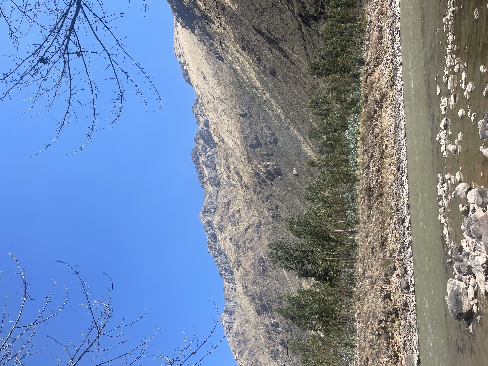{group="rafting" description="The river we rafted down"}

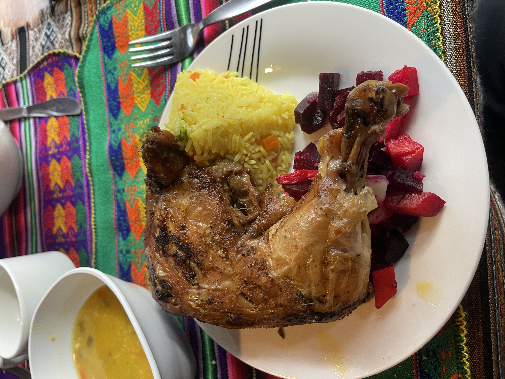{group="rafting" description="The feast following the rafting"}
:::

Morgan and I woke up at 7:30 a.m. to relax before we were picked up for rafting at 9:15 a.m. The drive was about 2 hours long, located south of Cusco. The drive was beautiful, and we got to see how different communities lived and made a living. There were many swap meets and street vendors along the road. Our destination was pretty deep in the mountains, so we took steep, winding roads. The valley had a hazy tint from all the cultural burns. Farmers often use these burns to redistribute nutrients and ensure their crops are as healthy as the last season. It also helps eliminate invasive species that could attract harmful insects or even kill crops. The smell from these burns was surprisingly pleasant, as they added some herb or incense to the fire. We could see the scorched fields stretching on for miles. Once we arrived at the base camp, we had a safety talk before going rafting. We then zip-lined across the river and back, which was a fun addition. Both of the zip lines were shorter than the warm-up line we did in the Sacred Valley, but still a fun experience. After everyone went, we prepared for the river ride, which was a 20-minute drive. We needed wetsuits, booties, helmets, and waterproof jackets. At the unloading spot, we received another safety talk from our guide, Cezar, who was hilarious and kept us entertained throughout the day. The first 20-30 minutes were spent on active participation, learning safety procedures and how to follow the guide’s commands. The rafting ride was 1 hour and 45 minutes, and every second was incredible. There were massive drops and fast rapids that we plowed through. Morgan and I were at the front, so Claudia and Mom had to follow our pace. I got into a ton of splashing battles with the other rafts, so most of the time, I wasn’t following commands. Although it was the dry season, the current and rapids were still exhilarating. Once we finished rafting, we hopped into a hand-built traditional wooden sauna to rinse off. The hosts of the tour had prepared lunch/dinner for us, which was served at 4:00 p.m. It consisted of chicken thighs and legs with rice and a potato-beet salad. The food was delicious and hit the spot. Morgan, of course, didn’t finish her meal, so I got to enjoy more chicken. This trip has been amazing, but my body is slowly deteriorating from all the activity and eating on the go, it’s tough eating like a normal person on the road. The drive home was quicker at first but got slower toward the end due to traffic. Morgan and I were pretty hungry, so we walked to the square to grab dinner. We went to a Pisco Museum restaurant, where all the food and drinks were made with Pisco. Morgan and I had traditional Pisco drinks and shared sliders. The food and drinks were amazing, a perfect way to end the day. We were in bed by 9:30 p.m. to ensure we got enough sleep for the ATV adventure the following day.

### Day 8 - ATV Adventure

::: {.lightbox layout="[[1, 1], [1, 1]]"}
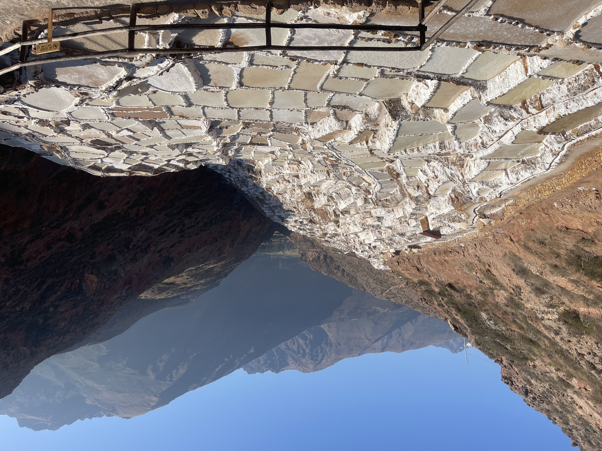{group="ATV" description="Salineras de Maras"}

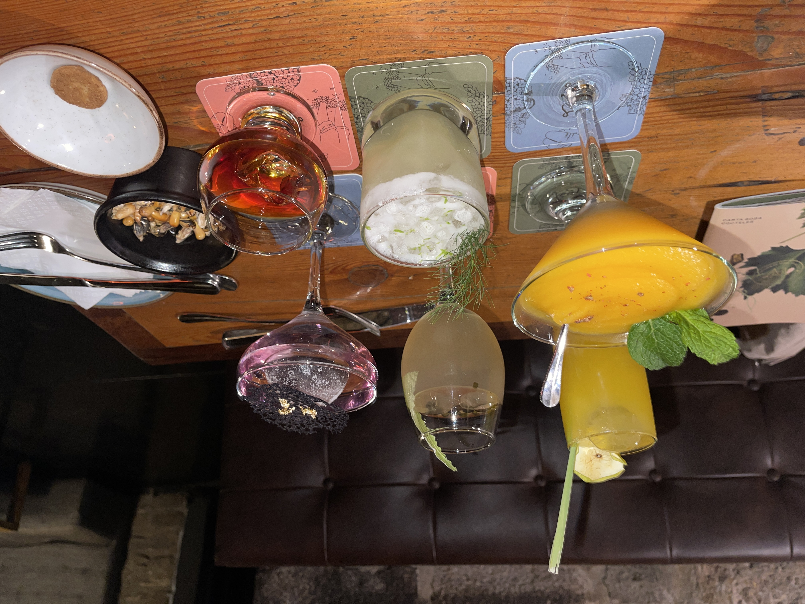{group="ATV" description="Pisco cocktail flight"}

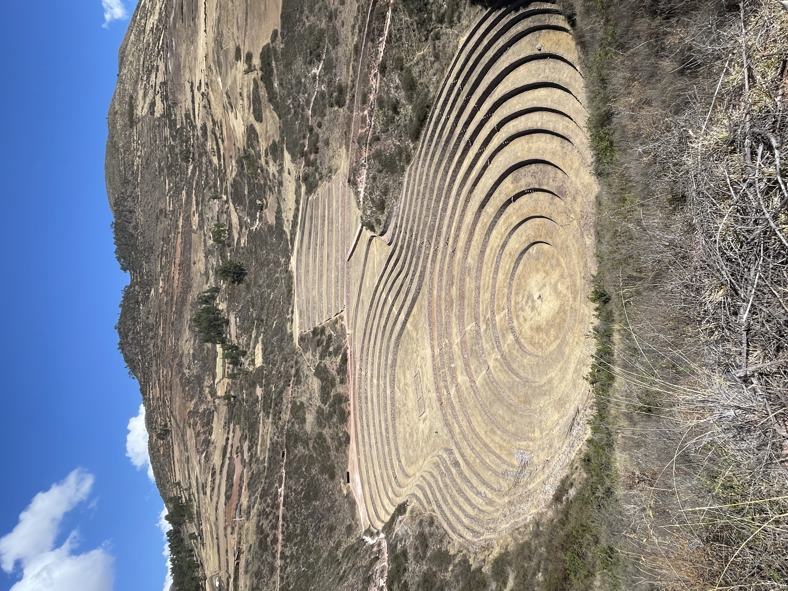{group="ATV" description="Terraces in Moray Peru"}

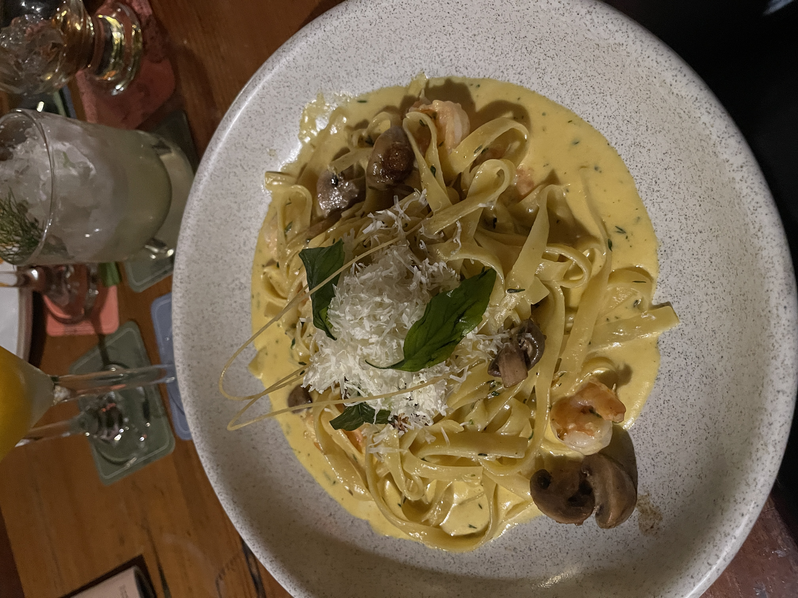{group="ATV" description="Last meal in Peru :("}
:::

We woke up at 5:55 a.m. and were picked up at 6:35 a.m. for the drive to the ATV garage. It was about a 2-hour drive, as we first went to Salineras de Maras, the salt mines. It was incredible to see the mines, located deep in the valley. The bird’s-eye view was unreal because there were so many salt pools. The mines are fed by salty spring water that comes down from the mountains. Local families in nearby communities can own anywhere from 5 to 30 pools. They only work during the winter season because, during the rainy season, the spring water isn’t salty enough. The pools produce three kinds of salt: pink, white, and brown, each with its own health benefits. To harvest the salt, each pool is filled with water from the spring. When the desired amount of water is collected, the channel is closed off with a rock. The water is about 20-30°C, which is warm enough to evaporate quickly, leaving the salt behind. The communities have agreed not to let any studies be done on the area because they still believe in Incan religion. They fear that any interference could stop the water, which would destroy their community's economy and livelihood. There are 3,744 pools in total, and most are attended to each day. After visiting the salt mines, we took the van to the ATV garage. The plan was to ride the ATVs to Moray, an ancient Incan agricultural site. It was about an hour’s ride, with some stops along the way to practice on the quads. Morgan was hilarious on the ATV, and we had a blast riding through the valleys and open fields, with snow-capped mountains and glaciers in the distance. The site, built by the Incas in the 15th century, had different terraces for growing specific crops. Each level of the terraces had its own climate, making it perfect for different types of crops. While we were there, a cool festival was happening, celebrating the Incan New Year, which falls on August 1st. We got to see traditional textiles worn by the Incas, and it was fascinating. We only had 30 minutes to explore before we had to head back, but it was still a great experience. The ride back was much quicker since the roads weren’t as crowded. It only took about 30 minutes, but we stopped several times for pictures and funny videos. We also saw adorable piglets and sheep running around in the fields, including the cutest litter of pigs. When we got back to the ATV garage, we took the van back to Cusco, but we were dropped off in a random square instead of the original pickup spot. Covered in dust and feeling sandy and uncomfortable, we walked to find some food. We ended up going to Qura, the breakfast spot we visited earlier in the trip. We had pretty much the same thing because it was so delicious. Afterward, we headed back to the apartment to shower and decompress. Later, we went out to get tattoos. My mom and I had originally planned to get tattoos, but Claudia and Morgan ended up getting one too. It turned into quite an adventure because it was a holiday and a Sunday, so most tattoo places were closed. We were lucky to run into a guy who was amazing and even called his friend to give tattoos to Morgan and Claudia. The entire process took about three hours. Afterward, we walked around some more and had food at Museo del Pisco. It was hard to try a new place since the food and drinks were so good here, but we took Claudia and my mom this time. We were in bed before 8:30 p.m. to make sure we got plenty of sleep for the long travel day ahead.
