### Day 1 - Lisbon

::: {layout="[1, 1]"}
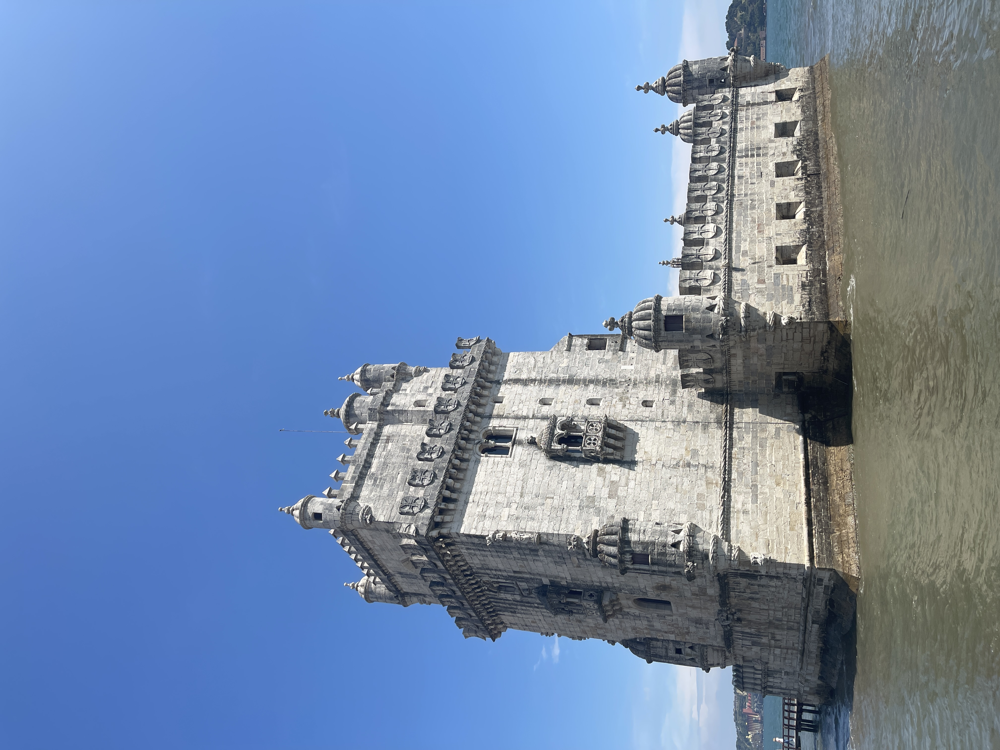{group="lisbon" description="Lisboa - Belém"}

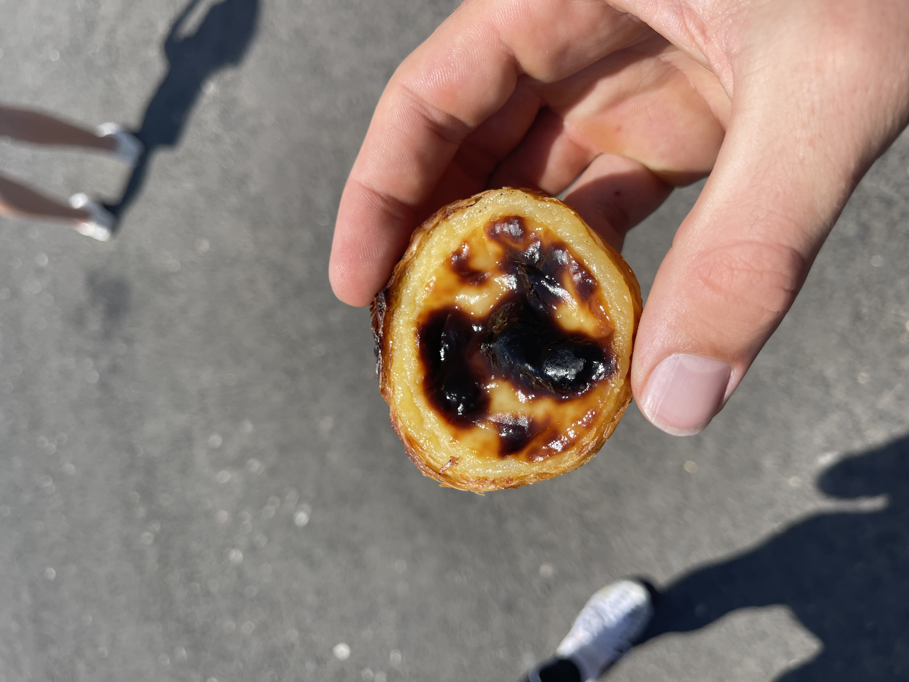{group="lisbon" description="Pastel de nata"}
:::

We flew into Lisbon, Portugal, around 10:00 a.m. Our original Airbnb turned out to be a scam, so we had to find a new one on the fly. The host was kind enough to let us drop off our bags. Mom stayed with the bags while Morgan, Claudia, and I went to explore the nearby area. We found a cute little lunch spot and had prosciutto and cheese sandwiches. They were amazing. The place overlooked the Castle of São Jorge up on the hill, with Lisbon's cityscape below. After dropping off our things, we headed out to tour the city. We walked down to Santa Maria Maior, which had tons of cool shops to pick up souvenirs. A street vendor thought Morgan and I were from Senegal, so he gave us free bracelets, surprisingly without trying to scam us, which is common in Europe. After browsing the shops, we went to Largos Portas de Sol, where we saw amazing monuments and statues. We made our way down to the famous Augusta Street, where there were tons of drug dealers and street vendors. Twice, I was asked if I wanted to buy cocaine. After passing through Augusta Street, we saw the famous Elevador de Santa Justa, which resembled the Eiffel Tower. Surprise! It was built by the same company that constructed the Eiffel Tower, which was interesting because the bridge across the Tagus River in Lisbon was also built by the same company that built the Golden Gate Bridge due to its earthquake resistance. After being approached about cocaine a few times, we explored Rossio Square, where we found a cool sardine shop. While looking around, Claudia was talking to a Tuk Tuk tour guide, and we decided to take a city tour for a little over two hours. He showed us incredible monuments with so much history. Lisbon is famous for its seven hills, which were formed after the great Lisbon earthquake in 1755. The earthquake set the city on fire on November 1st, coinciding with a Catholic holiday when thousands of candles were lit in celebration. This led to the city burning for 10 days, and shortly after, a tsunami rolled in. After all this destruction, Roman tunnels were discovered beneath the city, showing that something good can come from devastation. We saw the Praça Duque da Terceira, the Belém Tower, the president's house (guarded by soldiers), the Monument of Discoveries, and much more. The Belém Tower used to be isolated in the river but is now connected to the shore. It served as a light tower, guard post, and dungeon. The Monument of Discoveries was built to honor those who voyaged out to sea, at a time when the world was still largely unknown, and people believed the edge of the horizon led to waterfalls and sea monsters. Around 200 ships left, but only 20 made it back. This was due to shipwrecks, getting lost, or sailors choosing to stay in Brazil. In the middle of all this, we went to Pastéis de Belém, a famous pastry shop known for its custard tarts. Only six people in the world know the secret recipe. We skipped the long line thanks to our Tuk Tuk chauffeur’s connections. This bakery was next to the famous Mosteiro dos Jerónimos, where many famous monks and celebrities are buried. To wrap up the day, we took a nap and then went out to the June festival, which was perfectly timed for our visit. It was only a 3-minute walk from our place, so we got mojitos and gelato before bringing pizza back to our place. It was nearly 11 p.m. by the time we ate, so we needed to sleep. The music and food vendors were amazing, and we’ll be sure to try them before leaving Lisbon. We completed this day with almost zero hours of sleep, after traveling for a day and a half.

### Day 2 - Porto

::: {layout="[1]"}
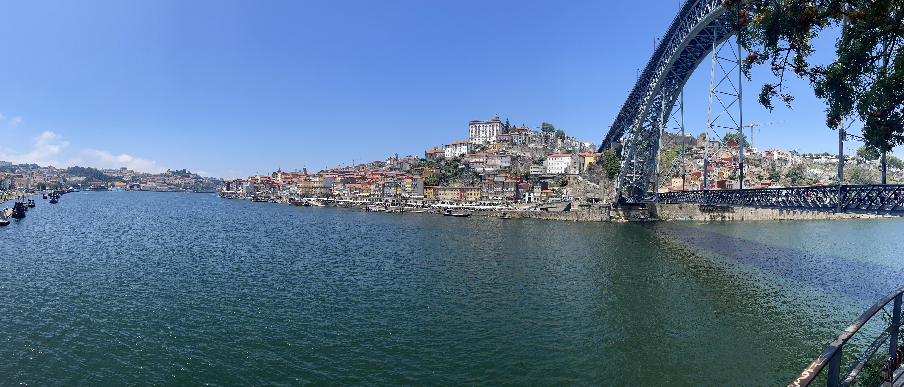{group="porto" description="Panoramic view of the Douro River in Porto"}
:::

::: {layout="[1, 1]"}
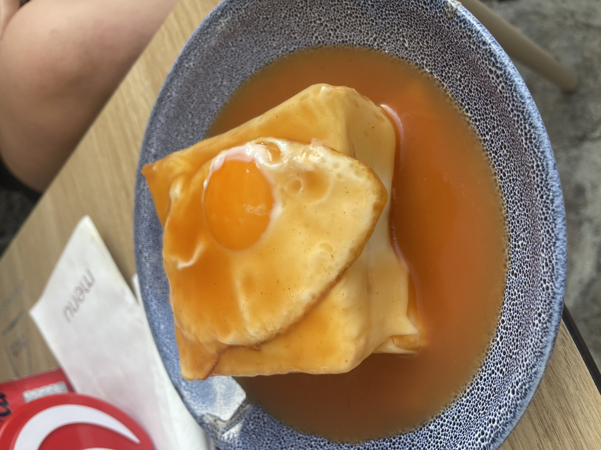{group="porto" description="A Francesinha"}

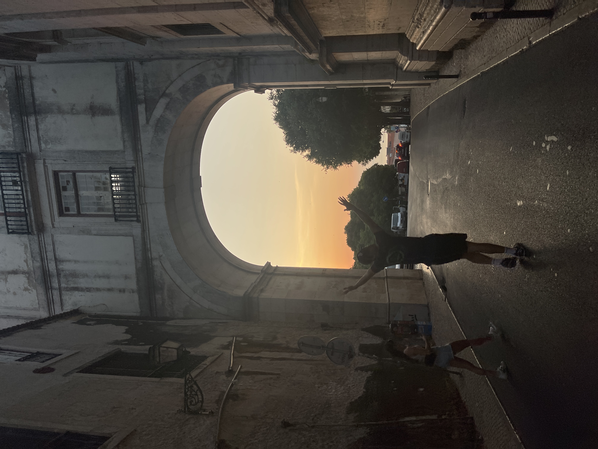{group="porto" description="A joyful moment before taking the train"}
:::

We woke up at 5:30 a.m. to catch the 7:00 a.m. train to Porto. The walk to the station took about 20-30 minutes, as we stopped to take pictures with the empty streets. It was a 3-hour train ride to Porto, and we arrived at 10:00 a.m. We took a taxi to São Bento and then walked up to the Paço Episcopal do Porto Cathedral, which was breathtaking. I got asked for weed twice just in that area. The cathedral had a deck that overlooked the city, and after taking it all in, we went to a quaint café. I ordered Francesinha, a famous Portuguese sandwich with two thick slices of bread, steak, ham, cheese, sausage, and a sunny side-up egg, all submerged in a boiling tomato-beer sauce. We took a yellow bus tour of the city, which was cool because it let us see a lot of Porto in a short amount of time. The bus driver was crazy! He handled the double-decker like a pro. After getting dropped off, we explored the Lello Library, which was super cool and famous for its small books and Harry Potter section. We also stopped at a beautiful church before heading to the Douro River to cross one of the famous bridges, built by the same gentleman who built the Eiffel Tower. We had lunch at a little restaurant by the river, with steak sandwiches and a liter of sparkling rosé. The view of the river was gorgeous with boats passing by, and Porto on the other side of the water. We spent some time killing time before our wine tasting tour at Cálem. The tour was interesting, as we learned about the process of aging Port wine and how it’s transported. They use boats from the vineyards up the Douro River to get the wine to the cellar. After the wine tasting, we rushed over for a boat tour, which was amazing. We got to see six famous bridges along the Douro River, with two of them designed by the same man who built the Eiffel Tower. We also saw the Monastery of Serra do Pilar and the Cais De Gaia, all from the best vantage point, the river. Claudia wanted to stop at McDonald’s to try the different menu, but she wasn’t impressed. We took the train back to Lisbon and arrived at 9:30 p.m. Once we Ubered back to the place, Morgan and I changed and went out for food. The festival was so crowded that it was hard to walk, but I found a nice vendor selling Portuguese cheeseburgers with a large gin and tonic. Morgan had the drink, and I had the burger. We tried finding a place to sit but it was too packed, so we decided to get gelato and call it a night.

### Day 3 - Sintra

::: {layout="[[1, 1], [1, 1]]"}
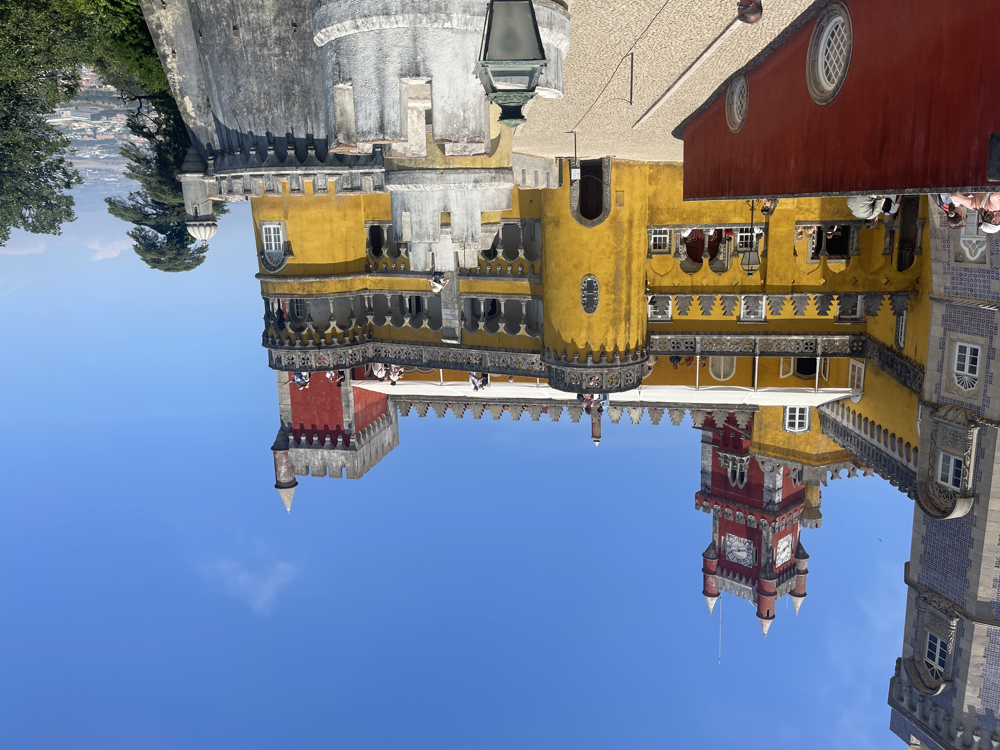{group="sintra" description="Pena Palace, Sintra"}

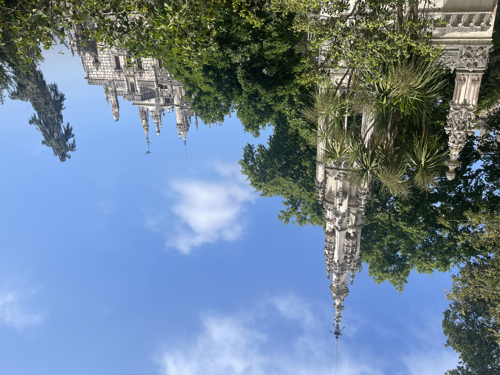{group="sintra" description="Quinta da Regaleira Manor"}

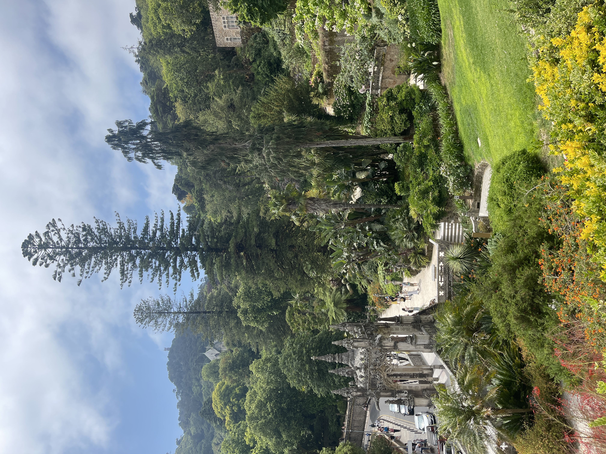{group="sintra" description="Quinta da Regaleira"}

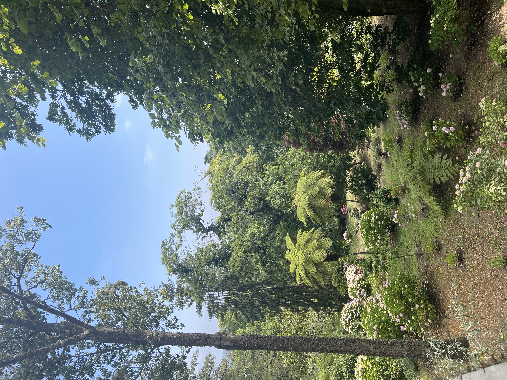{group="sintra" description="The gardens at Quinta da Regaleira"}
:::

We had another early morning and woke up just before 7:00 a.m. We walked down to Rossio Square to meet our tour. We had some time to spare, so we grabbed pastries to tide us over. The tour took us to Sintra, which was about 30 minutes away from Lisbon. Sintra is dedicated to the goddess of the moon, Selene. It’s humid at the top of the mountain, so Morgan wasn’t too happy about that. We arrived in Sintra around 9:30 a.m. and had 20 minutes to explore, use the bathroom, and get coffee. We headed to the Quinta da Regaleira Garden, which was stunning with its unique architecture and beautiful gardens. A single person funded its creation for the pleasure of providing a place for the community. Unfortunately, Sintra has fallen into a slump, as the resources needed for it to thrive have deteriorated. Not many residents live there, and most people commute from neighboring cities for work. The garden, however, remains a huge attraction due to its offerings. After the garden tour, we grabbed chicken pies at a lunch spot and then toured the Jardins do Palácio de Seteais. We met at the bus at 1:10 p.m. to head to our next stop, the Moorish Castle. Built in the 18th century by the Moors, this castle sat on 89 acres on top of the mountain. Next, we went to the Palácio Nacional da Pena, a massive palace that was filled with intricate details and stonework. It was impressive, yet only seven people ever lived there. The palace is rich in history, with priceless paintings, mosaics, furniture, and iconic war artifacts. The castle surrounding the palace was once occupied by soldiers to defend the royal family. King Carlos I and Queen Amélie lived there, and although their marriage was arranged, they eventually fell in love, which was rare. Queen Amélie was later exiled when the republic was overthrown. The palace was originally built in the 18th century and is one of the largest and most intricate palaces of its time. After touring Sintra, we headed to Cascais, a charming town that reminded me of Monte Carlo, though not as fancy. Cascais was once a prosperous fishing village, and the harbor was lined with both small and large fishing boats. We grabbed flatbreads and fruit tarts for a quick snack to explore the town. It wasn’t much to see, as it’s a beach town, and we didn’t have our swimsuits. It was a 30-minute ride back to Lisbon, passing through many coastal towns, including those that were home to spies and generals who met at Casino Estoril during WWII. We got back to Lisbon a little before 6:00 p.m. and walked back to our room, which was uphill and about a mile away, great for calves! We got ready for our dinner reservation at a popular restaurant just 20 steps from our place, called Vino Vero. The wine was fantastic, and we ordered two bottles. We had a ton of appetizers that essentially turned into a full meal, followed by dessert. It was a great dinner for our last night in Portugal. After packing, Morgan and I went to the festival for "Sagres" beers, a local favorite. After every night, bottles of Sagres were lined up along the sidewalk. It’s a super light and fizzy beer, and we weren’t disappointed. We enjoyed the music while drinking beer and wine. Couldn’t ask for more!

### Day 4 - Lisbon to Seville

The family and Morgan woke up at 3:45 a.m. to get ready to leave Lisbon. Surprisingly, it wasn’t too difficult, despite the beverages Morgan and I had the night before. We were running on roughly 4 hours of sleep again. It was a 25-minute taxi ride to the airport, and once we got there, everything went smoothly and efficiently. We made it to the gate in less than 45 minutes from leaving our place! If only the U.S. could be this organized… We relaxed in the airport as we had about 2 hours before departure. It was busy, but there was no line for checking in or security. The airport VIP lounge was great, free water, snacks, coffee, fruits, and even beer (though it was a little early for us). The timing was perfect because we had an hour to sit in comfy chairs before our flight. The flight was quick, and when we landed in Seville at 8:30 a.m., the weather was fantastic. It was a little hotter than expected but still bearable. We couldn’t check in until 4:00 p.m., so we rented a car and drove to Córdoba. It was about an hour drive, and the scenery along the way was beautiful. The Seville countryside is much more open than other parts of Spain, with huge fields growing sunflowers, wheat, corn, and hay. Córdoba was cool, it looked like Mexico when we first arrived, but as we got further into the city, the architecture and buildings went back hundreds of years. We had lunch at a place that served food similar to what you’d find in the U.S. After lunch, we visited the Tower of La Calahorra, an old fortified gate built by the Moors to protect the river it rested upon. After that, we headed to the Cathedral of Our Lady of the Assumption, which was breathtaking. The ceilings were stunning, and the sermon room was mind-boggling. The architecture and intricate details in the trimming were amazing, words can’t do it justice. Morgan and I sat down in the pews where the service would be held, just admiring all the beautiful details. The tour of the cathedral took over an hour. Afterward, we walked down the famous Calleja de las Flores, a narrow street lined with white buildings and flower pots hanging everywhere. It also lined up perfectly with the clock tower of one of the cathedrals, which was very beautiful. We did some window shopping, and everyone tried caramel sunflower seeds. Morgan, Claudia, and my mom also tried caramel-covered grapes. We tried to visit one last place, but it was closed on Mondays. Disappointed, we headed back to the airport to drop off the rental car and then went to the Airbnb. We arrived around 5:00 p.m. and tried to relax. Morgan and I were starving, so we walked around for food. After a solid mile of walking, we finally found the perfect place to eat instead of settling for something near the Airbnb. We tried a cool flatbread and dessert place before heading back to the room. Morgan and I went to sleep around 11:00 p.m., enjoying our time in such a cool city.

### Day 5 - Granada

::: {layout="[[1], [1, 1, 1]]"}
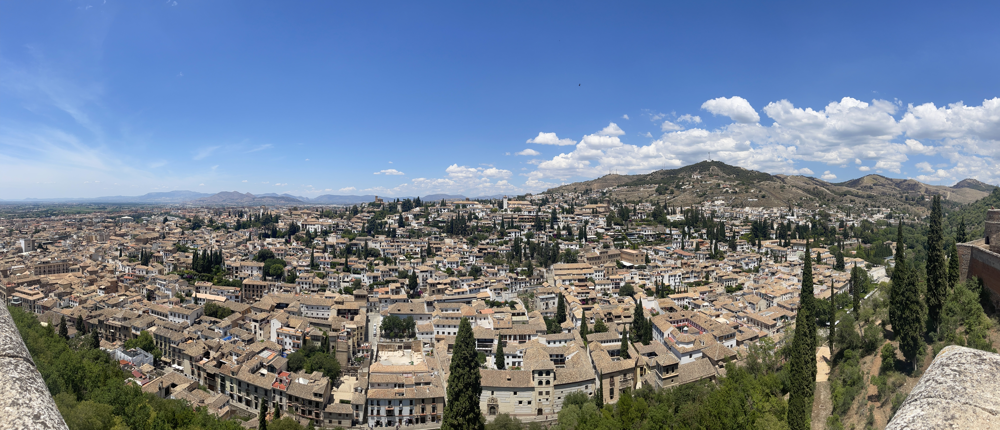{group="granada" description="Pano of the city"}

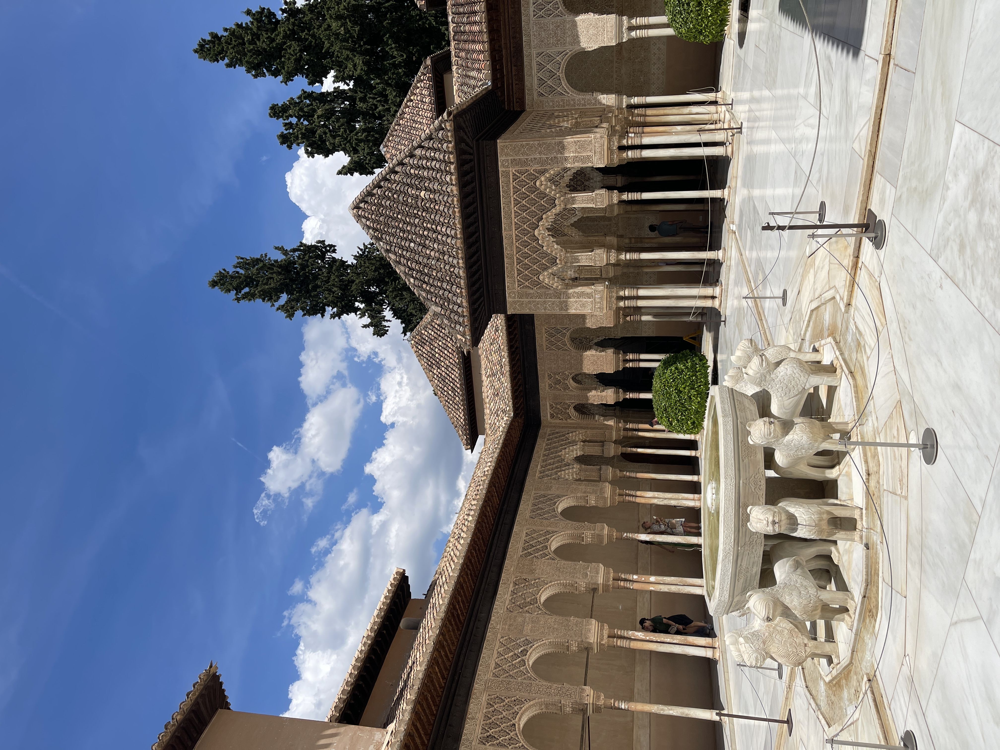{group="granada" description="Garden in Nasrid Palace"}

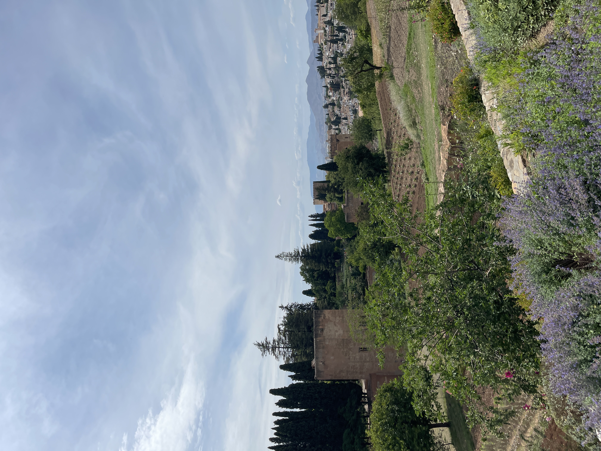{group="granada" description="Garden in Nasrid Palace"}

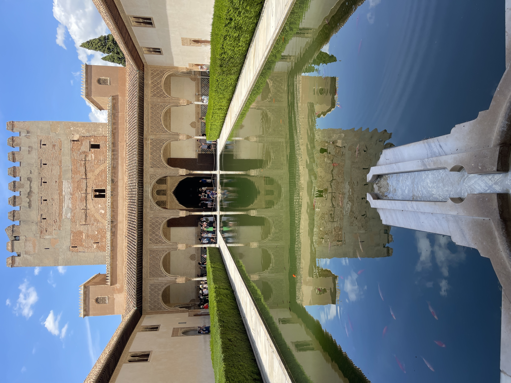{group="granada" description="The moon temple"}
:::

We woke up at 6:00 a.m. but ended up sleeping in until 7:00 a.m. Sleep has been hard to come by on this trip. The meeting point for the bus was only a 5-minute walk, so we left just in time. The bus ended up being 45 minutes late, so we got a late start to our Granada tour. The drive to Granada took about 2.5 hours, and we weren’t allowed to eat or drink on the bus. The tour guide also decided not to stop for breakfast because of the delay, which was frustrating. Along the way, we passed endless olive trees and sunflower fields. Olive trees are essential to Spain’s economy because of olive oil production, and Spain has over 240 million olive trees in the Seville region. However, they require a lot of water, which has become problematic. Sunflowers are also important in Spanish culture and for oil production. Halfway to Granada, we stopped at a truck stop for a quick bite, as we were only given 12 minutes. When we arrived in Granada, we met at Plaza Larga, a popular spot in the city. The city is known for its clever use of hydraulics, especially during the time when the Muslims controlled the area. When the Christians took over, one of the first things they cut off was the water supply, which the Muslims had valued so highly. The city is surrounded by mountains with snow-capped peaks, which was a refreshing sight given the heat of the day. We drank from the nearby water spouts, which were crisp and refreshing. We walked to some cool decks for a better view of La Alhambra, our next stop. After splitting from the group, we bought some paintings from an artist known as “el hombre invierno.” We also had lunch at a café overlooking the river/canal, where we saw large catfish swimming in the shallow waters. After lunch, we visited Casa Masó, designed by architect Rafael Masó in 1911. While his work wasn’t as groundbreaking as Gaudí’s, it was still impressive. The tour to La Alhambra was the highlight of the day. This complex, built by the Moors, is named for the red-colored walls, which are the same color as the soil surrounding the area. It’s been standing for over 800 years, and it was the last Islamic stronghold in Granada. The architecture was stunning, with towers and walls guarding the area. Charles V had several Italian-style palaces built within the Alhambra, but he eventually realized it wasn’t the best location due to its distance from other key regions. One of the most impressive parts of the complex was the Nasrid Palace, built in the 14th century. The Moon Temple, with the inscription “there is no victor but God,” was a very intimidating space, as only one person could be in the room at a time. The design was meant to convey power and dominance. After a quick break for pizza and ice cream, we explored the Jardines del Partal, a beautiful garden with colorful flowers, hedges, fountains, and ponds full of lily pads. The shaded pathways provided a respite from the sun, and it was the perfect way to end the tour. We left La Alhambra around 5:10 p.m. and had a 3-hour commute back to Seville. We arrived around 8:30 p.m. and walked back to our place. After unloading, Morgan and I went out for dinner. We ordered sangria and calamari tapas, followed by sirloin with sunny-side-up eggs and fries. Morgan had the same dish, but with chicken. Dessert was simple, gelato from a stand in the restaurant. Afterward, we headed back to the room and called it a night. Another busy day full of adventure.

### Day 6 - Seville

::: {layout="[1]"}
{group="Seville" description="Plaza de Espania"}
:::

Today, we got to sleep in a bit, waking up around 8:00 a.m., which was very rejuvenating. We headed out to a quaint little café where I had eggs Benedict. It wasn’t quite the same as back home, but it was still delicious. Many of the cafés in Seville transform into bars in the evening, offering a great setting for breakfast. After breakfast, we went to the Plaza de España, and wow, it was breathtaking. The plaza was built to showcase the country of Spain, with dedicated benches for each city. Each bench was unique, reflecting the history of its respective city. The symmetry of the plaza made it perfect for photos, and there was even a little moat where you could rent a boat and row around the center. After exploring the plaza, we walked to the Parque de María Luisa, a lovely park filled with waist-high hedges, statues, and fountains. It was a peaceful place to stroll and take in the scenery. We came across the Hotel Alfonso, which was magnificent in its detail. Claudia and my mom grabbed cocktails while Morgan and I admired the beauty of the hotel. We did some window shopping and found some incredible artwork. I bought a bull painting, Claudia picked up a horse head, and my mom bought a painting as well. These were original works from a local artist, not the typical souvenir art you find at tourist shops. While walking through the downtown area, we made our way to the Cathedral of Seville. Our first stop was the Giralda Tower, which had 40 floors. The view from the top was hands-down the best view of the city. The Cathedral itself had amazing altars and stained-glass windows, truly a masterpiece. Afterward, we grabbed a quick slice of pizza before heading to the Real Alcázar at 3:30 p.m. The Patio de la Montería in the Real Alcázar was stunning, with fountains, hedges, and flowers. The walls and roofs had incredible inscriptions. Like many of the buildings we’ve seen in Spain, the Alcázar was originally built by Muslims. We also visited the Chapel of the Virgin, the Escalera y Tapiz (the most important part of the palace), the Jardín del Príncipe (where "Game of Thrones" was filmed), and the Jardín del Marqués de la Vega Inclán. After the long tour, we headed back to rest because we had a flamenco show to attend later. Before the show, we had paella and a few glasses of wine. By the time we went to the show, I was a bit tipsy, thanks to a free round on the house. The flamenco performance was incredible, so intense and alive. The dancers were so fluid and expressive, and it was definitely a night to remember. That was our last night in Seville, and we ended it with a bang

### Day 7 - Seville to Barcelona

We woke up around 5:45 a.m. to head to the airport. It was a stressful morning. We had planned to take an Uber, but the fare was \$60, so we tried calling a taxi, but no one answered. We then walked out to the main road to hail a taxi, but that didn’t work either. Eventually, we got an Uber, but just as we were waiting, it started pouring rain. This little hiccup took around 45 minutes from the time we left the place. Once we made it to the airport, the process was smooth and efficient. It was crowded, but there were no lines for checking in or for security. The timing was perfect, and we had about an hour to relax in comfy chairs. The flight was quick, and when we landed in Barcelona, the weather was fantastic. It was a little hotter than expected, but still manageable. We couldn’t check into the Airbnb until 4:00 p.m., so we walked to the beach. The walk was about two miles, and I convinced everyone it was better than sitting in traffic or taking the metro. It was a nice walk as we passed cool shops and buildings. Once we got closer to the coast, the breeze made it much more pleasant. We found a cool beach restaurant to hang out at and spent a couple of hours on the beach, soaking up the sun. It was a nude beach, so we were caught off guard when we saw some topless women and naked men as we walked to find a spot to lay our towels. The beach was a little overwhelming with all the sellers, every 30 seconds, someone would approach us asking if we wanted to buy towels, mojitos, henna tattoos, massages, etc. It got to a point where it was the same person asking repeatedly. Morgan and I had our fill of the beach and walked north in search of some water. Along the way, we passed a lot of older, naked men in the designated area for nudity. We didn’t find water, so we sat down at one of the beach restaurants and decided to order a liter of sangria with some water. It was delicious. Claudia and my mom joined us and ordered a liter of sangria too. After spending time at the beach, we decided to walk back to the Airbnb instead of taking the metro. On the way back, we passed through a little festival in Catalonia Square with street vendors and food stands. We rested for a bit and then went shopping for a few hours. The designer brands in Barcelona were much cheaper than back home, and we also got a tax refund at the customs desk at the airport. Afterward, we stumbled upon a flatbread and dessert place and grabbed dinner to go. We ate in our apartment, which was like a New York City penthouse. Morgan and I went to bed around 11:00 p.m. since we were enjoying our time in such a cool city. That’s it for Day 7!

### Day 8 - Antoni Gaudí tour in Barcelona

::: {layout="[[1, 1], [1, 1]]"}
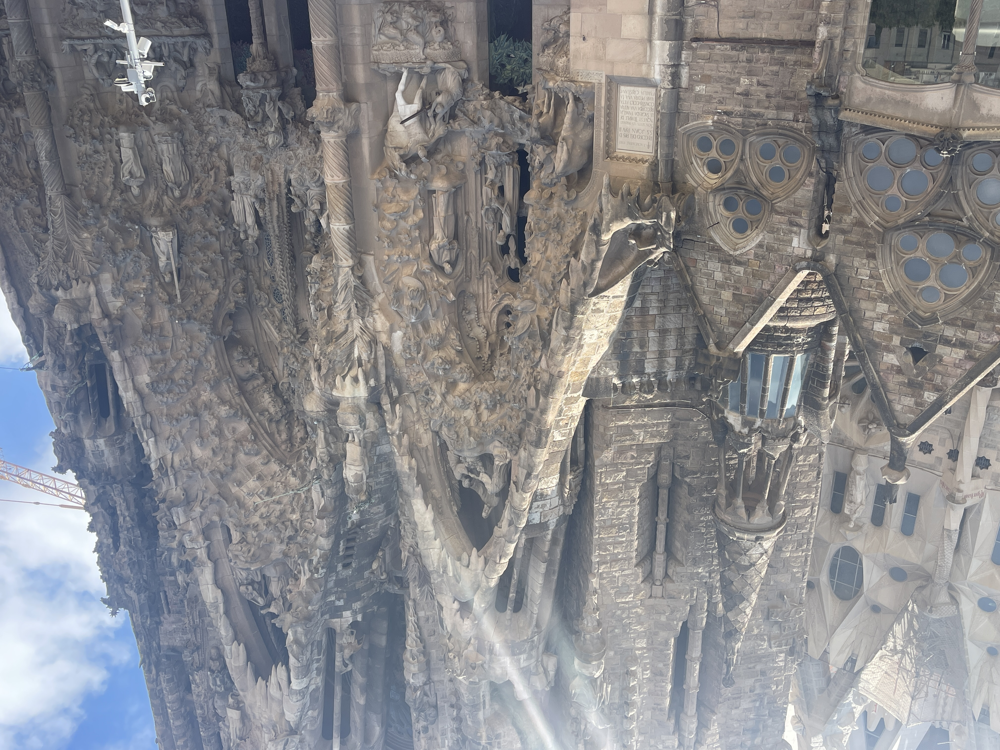{group="barcelona" description="La Sagrada de la Familia by Antoni Gaudí"}

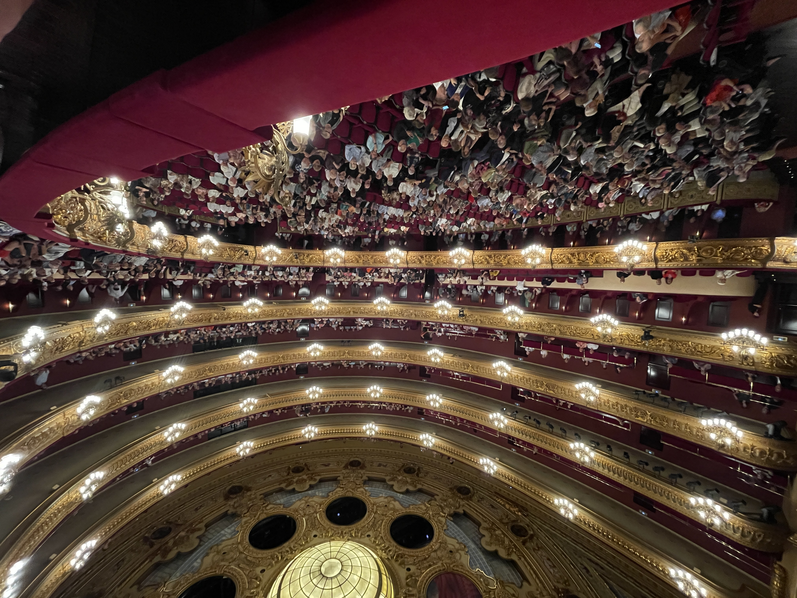{group="barcelona" description="The Gran Teatre del Liceu Opera House"}

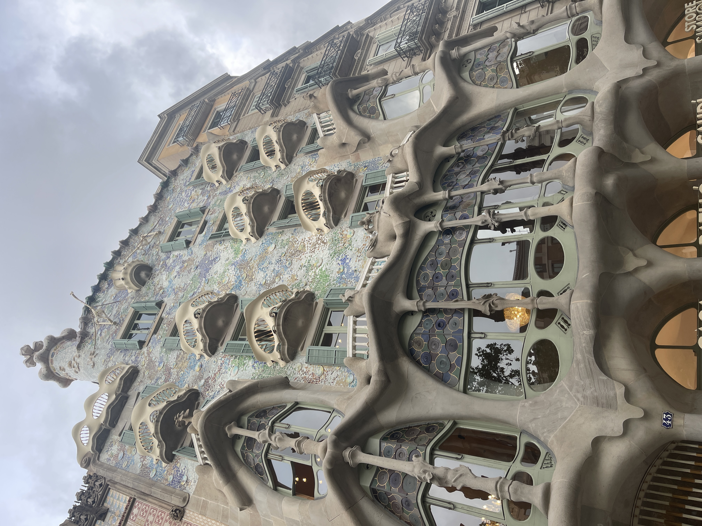{group="barcelona" description="Casa Batlló by Antoni Gaudí"}

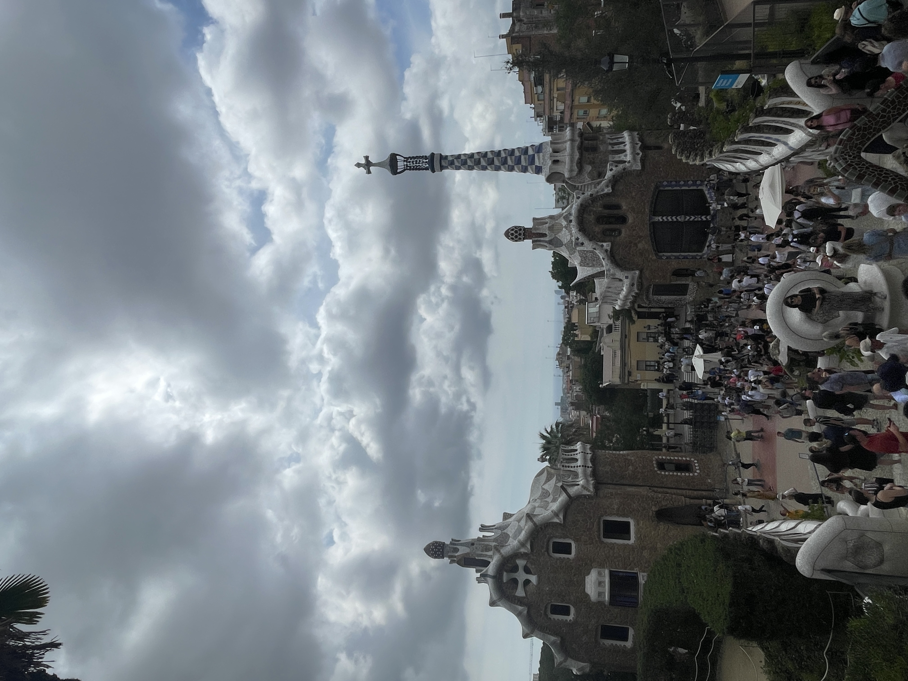{group="barcelona" description="Park Güell by Antoni Gaudí"}
:::

Today, everyone got up at 7:30 a.m. since we needed to leave for the Gaudí tour at 8:20 a.m. This was a highly anticipated tour because of how renowned Antoni Gaudí is. We met our guide at the first stop, Casa Batlló. This building was constructed in the late 18th century and heavily influenced by the famous tale of Saint George. At the time it was built, the street it sat on was an up-and-coming area for wealthy families. Next to Casa Batlló was the first modern home built on Passeig de Gràcia, the street that both houses were located on. This building was influenced by Dutch architecture because the architect was, as our guide put it, "chocolate," and wanted the building to resemble a place where they had the best chocolate, places where the Dutch lived. Let me just say, Antoni Gaudí’s work was incredibly symbolic. No matter how small the detail, there was always a deeper meaning. Gaudí and his family were Catholics, and on many of the buildings he designed, he included a cross with compass points in North, East, South, and West. Imagine a cross with extra horizontal arms pointing in each direction. This was just one example of how he took something simple and made it incredibly intricate. Gaudí had an abstract mind and designed each building so that every component, no matter how small, had meaning behind it. Gaudí didn’t use straight lines, every object was curved or bent to follow the contour of the walls or windows. It was impossible to find a straight line in any of his buildings. After Casa Batlló, we walked to another Gaudí-designed building, Casa Milà. This building has six floors with 20 unique apartments. We couldn’t go inside because people still live there, but it was impressive from the outside. We also passed a building that Gaudí had no involvement in, La Casa de les Punxes, which was built by Germans. It was beautiful, and we stopped to admire it. Next, we took a short bus ride to Park Güell, which opened in 1899. Gaudí designed this park with the intention of creating a gated community for wealthy families. The park was constantly busy, and Gaudí struggled with traffic. The square in the center of the park had benches with little grooves to massage your back. The roof of the benches was covered in mosaics, and beneath them was a market square where merchants would sell their goods. The columns had white tiles that dispersed sunlight and created a calming effect on the shaded area below. Gaudí didn’t use straight lines here either, and the uneven columns created a sense of intimidation as you walked up the rows. The roof had beautiful mosaics in the middle, and the rest of the roof was mostly covered in white tiles to reflect light. After Park Güell, we headed to our final stop, the Basílica de la Sagrada Família. This was by far the most beautiful place I’ve ever seen. The basilica is dedicated to the Holy Family, Jesus, Mary, and Joseph, and has 12 bell towers to symbolize the 12 apostles. Keep in mind, the church is still not even halfway finished. Gaudí knew it wouldn’t be completed during his lifetime, but he was okay with that because he believed people would fall in love with it. After Gaudí’s death, anarchists protesting the Spanish Civil War burned down his workshop, along with everything inside. The only thing that survived were the molds, which were later used to finish his vision. The inside of the church is overwhelming with detail, but in a good way. The ceilings were incredibly high and had so many contours and domes that it was hard to focus on any one section. There were columns everywhere, some probably 5 feet wide, but none of them were straight. Stained glass covered the windows, with green-to-blue colors on one side representing cool waters and orange-to-red colors on the other side representing warm waters. These were just small examples of Gaudí’s symbolic design choices. Words can’t do this man justice, he was one of a kind. After the tour, we went to the fashion district to do some more shopping. On the way back, we saw Gaudí’s buildings again, which was just as amazing the second time. After some shopping, we returned to the room to get ready for the opera. The opera, "Orfeo ed Euridice V.C." at the Gran Teatre del Liceu, was fantastic. The first half was incredibly interesting, with talented opera singers holding notes for long periods. I couldn’t understand the lyrics, but after reading the program, it all made sense. The second act was a bit underwhelming at first, but it picked up toward the end when the backup singers joined. Afterward, we went to a dessert place where I had a massive bubble waffle with gelato inside. It was delicious. We got a taxi back to the room and called it a night. Another spectacular day.

### Day 9 - Day trip to Girona

Today was the last day of our trip. We woke up at 7:00 a.m. and then took a train to Girona, which arrived at 9:50 a.m. The first stop was the Cathedral de Girona. Although we didn’t go inside, the exterior was still incredible to admire. The cathedral’s construction started in the 11th century and wasn’t completed until the 18th century (1773). We chose to visit Girona instead of staying in Barcelona for another beach day because this is where the Sept of Balor from Game of Thrones was filmed. It felt surreal walking through the streets, as the scenes from the show kept playing in my head. We also visited the baths where the wealthy used to go for a spa day. It was interesting to see how people lived before modern advancements in society. Afterward, we had food at a café with a beautiful view of the river/canal. Although the canal wasn’t in the best condition, it was still lovely, and we saw big catfish swimming in the shallow waters. For lunch, we went to Casa Masó, designed by Rafael Masó in 1911. Masó was born in Girona into a conservative Catholic family and admired the work of Gaudí. While his work was impressive, it wasn’t on the same level as Gaudí’s. It’s hard to compare anyone to Gaudí after seeing his work firsthand, his projects were monumental and unlike anything anyone could imagine. After visiting Casa Masó, we had some time to kill before our train back to Barcelona. We walked around, exploring the city and doing a bit of shopping. At 3:10 p.m., we caught the train back to Barcelona. Morgan and I took a quick shower and got ready for our last meal in Barcelona. We went to a super popular restaurant just 4 minutes from our place. The meal was amazing! We shared a bottle of wine and ordered a bunch of tapas. After about 10-15 minutes, a lovely Australian couple sat next to us and asked how tapas worked. They were on a 3-week Viking Cruise, and Barcelona was their last stop. They were probably 50 years older than Morgan and I, but they were a lot of fun to talk to. They ended up ordering everything we had, and we shared stories over wine. The husband even drew me a map of Australia and explained each part of the island. It was a fantastic final dinner, and I’ll cherish the conversation we had. After dinner, we rushed to meet Claudia and head out to the bars with one of her friends. I knew him, but not super well, as he was a grade above. We had all gone to the same elementary, middle, and high school, so we knew a lot of the same people. The bar, called Dow Jones, was like no other place I’ve been. The prices of drinks changed depending on how many people were buying them. If a drink was popular, the price went up, and if it hadn’t been bought in a while, the price dropped. Every 20 minutes, there was a “market crash” where all drinks became much cheaper. Morgan and I left around 11:00 p.m., as we had to get up at 6:00 a.m. the next morning. We got back to the room, packed a little more, and reflected on how much we had experienced in such a short time. Barcelona was probably my favorite place on the trip, and I’m seriously considering studying abroad here or moving here for a summer. Europe has been an exquisite experience, packed with history and adventure every day. That’s it for the journal, thank you for reading!
