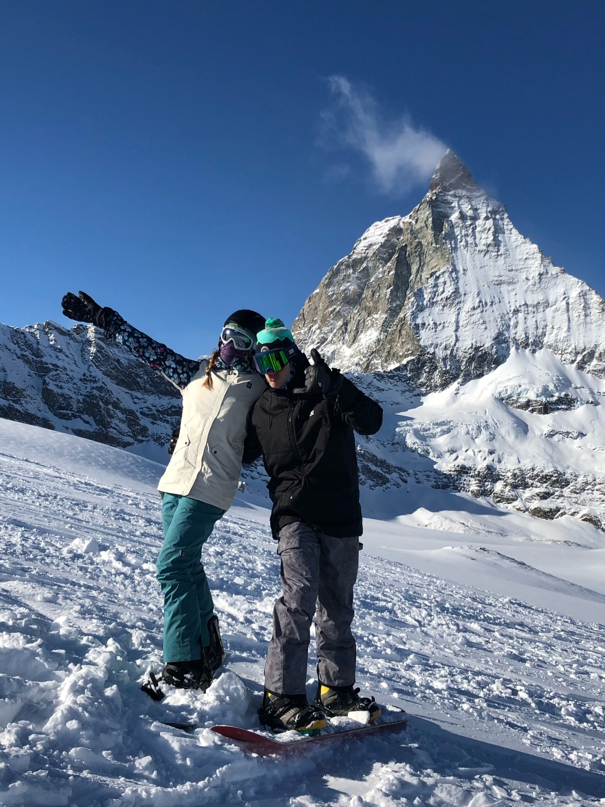
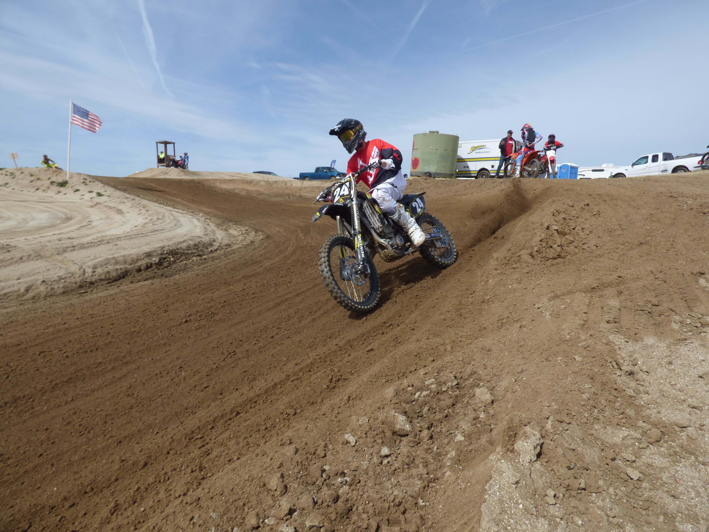
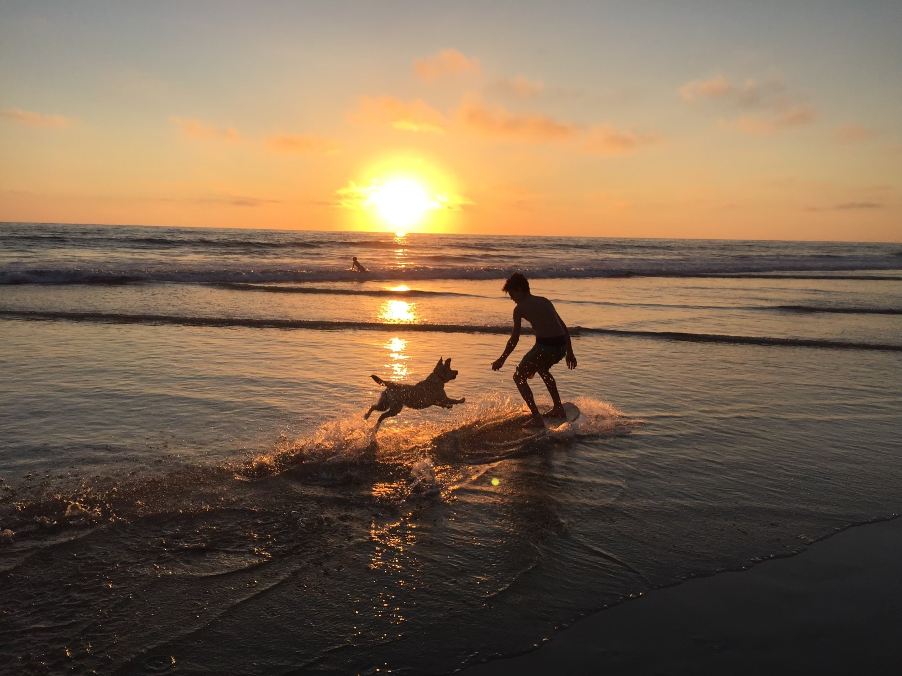
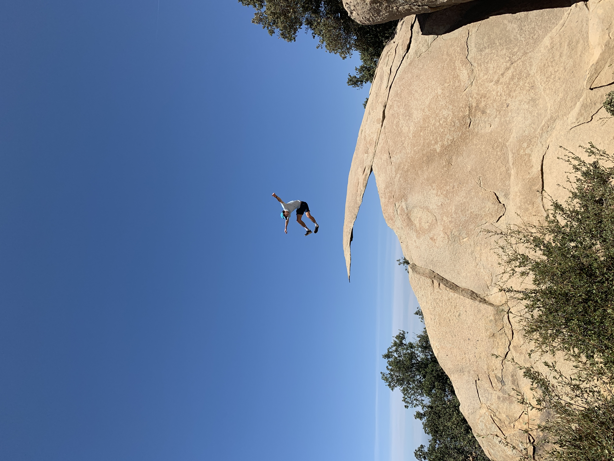

---
filters:
  - lightbox
lightbox: auto
freeze: auto
format:
  html:
    toc: false
---

::: {layout="[[1, 1, 1, 1]]"}
{group="sports" 
description="Snowboarding in Switzerland" width="200"}

{group="sports" 
description="Qualifying for State" width="200"}

{group="sports" 
description="Sunset Skimboard Session" width="200"}

{group="sports" 
description="Potato Chip Rock" width="200"}

:::

::: {.text-center}

I’ve always been drawn to sports and movement. Growing up, I played baseball, soccer, and just about every action sport I could get into. Whether it was surfing, skateboarding, mountain biking, racing dirt bikes, or snowboarding, I was always chasing the next adrenaline rush, and honestly, not much has changed.

#### Snowboarding Clip

  <video width="640" controls>
    <source src="files/snowboard.mov" type="video/quicktime">
    Your browser does not support the video tag.
  </video>

Over the past few years, after high school, I’ve gotten into golf and focused on the craft. I still surf regularly, especially with Santa Barbara’s breathtaking coastline running parallel to the Santa Ynez mountains, and I make sure to snowboard every winter. UCSB’s intramural sports have also been a highlight. Getting to play basketball and soccer with friends has been a great throwback to the sports I grew up on. It has been a huge reality check on how you can fall out of touch with your skills and ability without using them for so many years.

Outside of organized sports, I’ve made lifting weights a consistent part of my routine. It keeps me grounded and energized. I also love taking my dogs on little adventures, whether it’s a trail, the beach, or just somewhere new for them to explore. More recently, I’ve been getting into running and rock climbing; it’s a totally different kind of challenge, and I’ve been enjoying pushing myself in new ways.

I am very fortunate to have been able to attend UCSB because living in Santa Barbara has been one of the most rewarding experiences. From being able to surf till sundown and going on morning runs, there is always so much to do. It has re-grounded me, and connecting with nature has been so freeing. I have been able to appreciate it more and more as I spend more time outside. The best part is that you can do it alone or with friends; the experience will be genuine no matter what. Living in the suburbs for over a decade and being so immersed in the social bubble, being outside has been a top priority while being in Santa Barbara.

If you ever need inspiration for fun scenic running routes, check out my Strava profile!! I don’t record many hikes, but there are tons of amazing trails in the foothills and near UCSB open space.
::::

