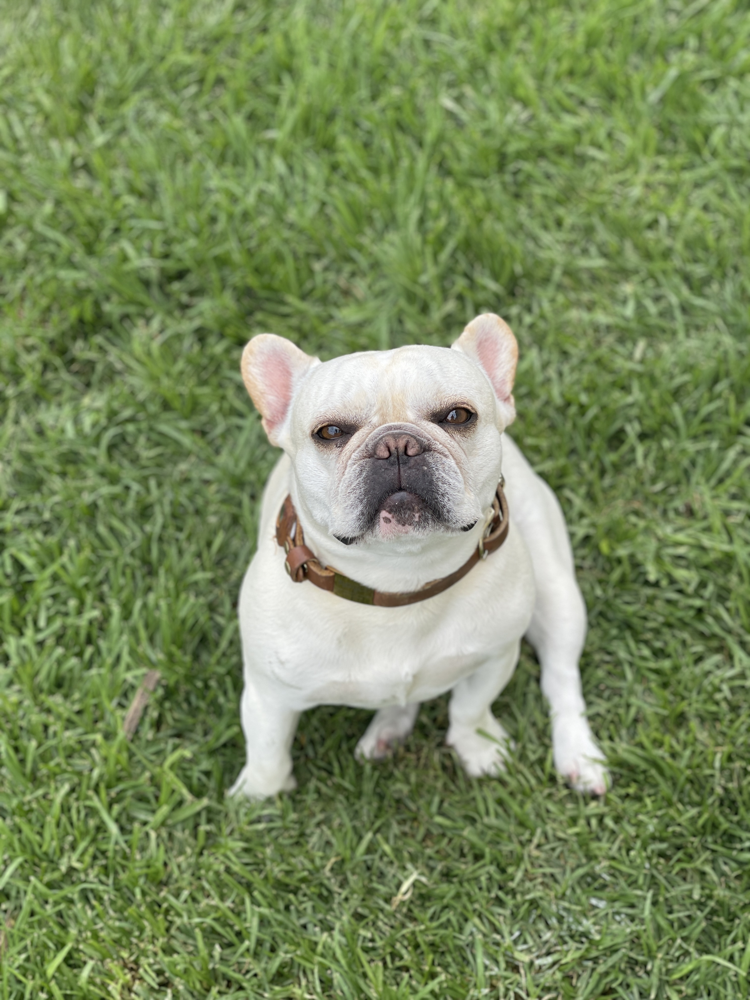
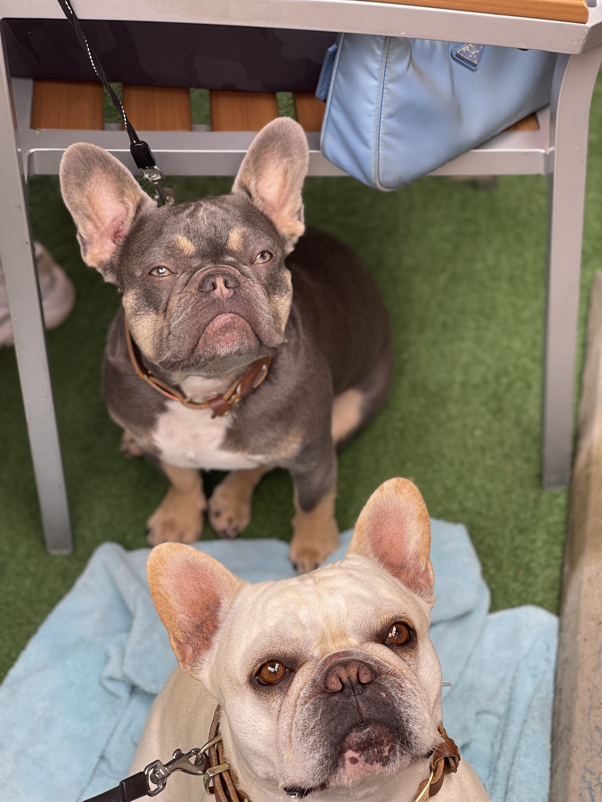
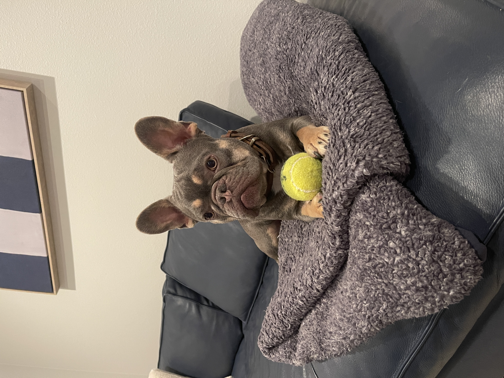
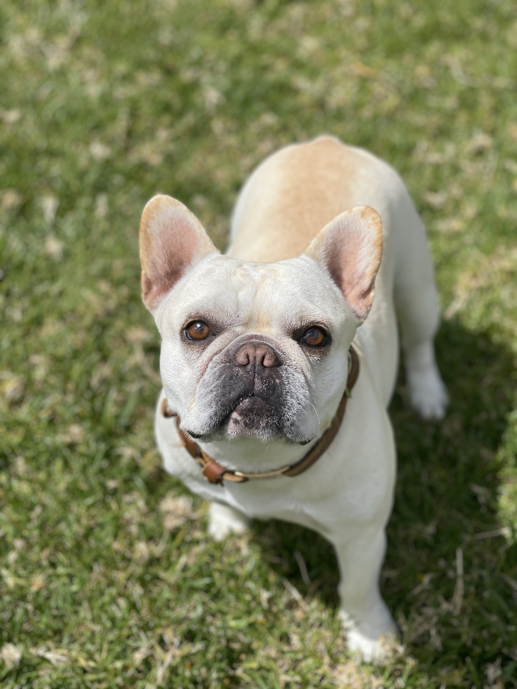
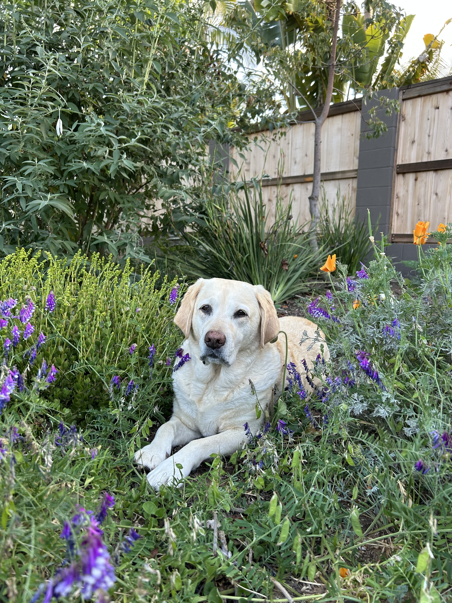
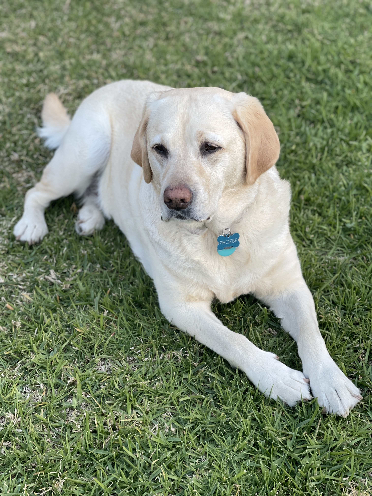
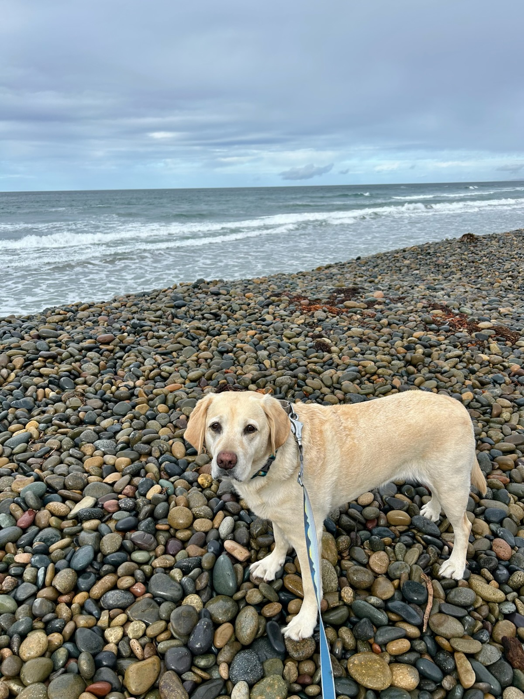

#### Royce and Phantom (sister and brother)

::: {layout="[[1, 1, 1, 1]]"}
{group="pups" description="Royce soaking up the sun." width="200"}

{group="pups" description="Royce and Phantom together begging for food." width="200"}

{group="pups" description="Phantom ready to pounce." width="200"}

{group="pups" description="Royce looking regal." width="200"}
:::

#### Queen Phoebe

::: {layout="[[1, 1, 1]]"}
{group="phoebs" description="Phoebe in the garden." width="200"}

{group="phoebs" description="Phoebe posing in the grass." width="200"}

{group="phoebs" description="Phoebe watching me surf." width="200"}
:::

::: text-center
I absolutely cherish all dogs. I’m the kind of person who’s immediately drawn to the dog in public. Their carefree attitude and unconditional happiness are something I genuinely admire, and it’s refreshing to be around that kind of pure energy. Dogs love you no matter your race, gender, or values, and there’s nothing more beautiful than that kind of loyalty.

I have two French bulldogs who are my entire world. Royce, the white one, is a few years older and has fully embraced her role as the big sister. She’s calm, sweet, and patient. Phantom, the gray one, came later, and I was much more involved in raising him. He’s the perfect balance of affectionate and energetic. Whether he’s curled up next to you or running around with a toy in his mouth (which is basically always), he’s just the kind of dog that lights up a room from wanting to play or barking at you if you don't entertain him.

We also have a yellow lab that is the smartest pup around. She (Phoebe) puts the frenchies to shame (not that they were ever on her level to begin with). She can do almost any trick in the book and then some. One Christmas I got her a puzzle board that you put treats in and she figured out the trick within minutes. Also, as you can see from the photos she is a model and loves to hangout on the beach and keep me company while I surf.

Over the years, we’ve had all sorts of pets, parrots, hamsters, guinea pigs, and even a potbelly teacup pig, but none of them compare to the pups. These days, we keep it simple: just the pups. And honestly, that’s more than enough with how much attention you must give them. They may be only a tiny part of your life, but you are their entire life, so understanding this and giving them the love they deserve should be the mission.
:::
